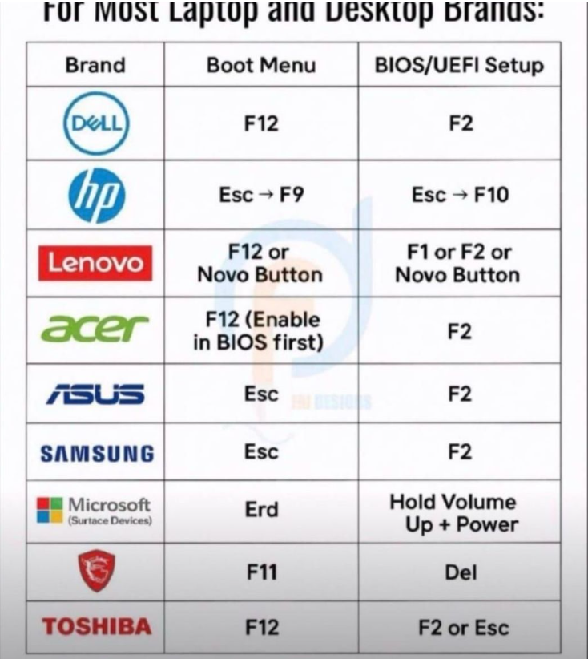
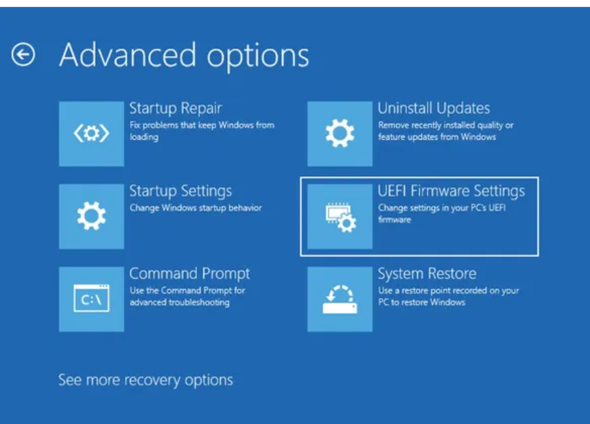

# قبل از ریختن لینوکس رویه ماشین مجازی ورفتن سراغه فایل دیگه این نکات رو حتما توجه کنید⚠

- ا <mark>(1)</mark>- اگر در ماشین مجازی میخواید بریزید باید اون فایل ISO که دانلود میکنید  رو از سایت معتبر خودش بریزی نه از سایت هایه دور و بر.
---

## صفر تا صد مراحل روشن کردن  مجازی سازی پردازنده:

- ا<mark>(2)</mark>- باید حتما گزینه مجازی سازی (Virtualization)رو داخله  BIOS/UEFI فعال کنید که بریم سراغ مراحلش:
- 2-1 مرحله اول : اینه که باید به Firmware سیستمتون برید که برای رفتن به firmware یا میان افزار سیستمستون :
- 2-1-1 ا<mark>مدل1</mark> گزینه restart رو میزنید  سپس باید  وارد **میان‌افزار سیستم** بشی ؛ یعنی همان **BIOS / UEFI Firmware Settings**.باید در هنگام صحفه مشکی یکی از کلید هایه esc ,f1tof12 ,del  رو امتحان کنید که این عکس هم براتون گذاشتم معمولا همین کلید هاست ولی اگر نشد 🙄اینارو تست کنید.

	

---

- 2-1-2ا<mark>مدل2</mark>مدل دو به این صورته که شما این مراحل رو در ویندز میزنید و به راحتی به میان افزارتون میریدwindows این مدل خخخخخخیییلی راحت تره برای رفتن به میان افزار یا firmware تون

→ Settings
→ System
→ Recovery
→ Advanced startup
→ Restart now
→ Troubleshoot
→ Advanced options
→ UEFI Firmware Settings
→ Restart

	

---
- حالا رفتید به میان افزار باید این کارهارو بکنید گزینه‌ی Virtualization داخل ویندوز نیست، داخل تنظیمات میان افزاز(firmware(UEFI/BIOS))  است
- 2-3بسته به برند مادربرد یا لپ‌تاپ، این گزینه ممکنه این اسم‌ها را داشته باشد:

- **Intel Virtualization Technology**
- **Intel VT-x**
- **Intel VT-d**
- **AMD SVM**
- **SVM Mode**
- گاهی هم فقط: **Virtualization**
- بسته به اینکه میان افزار (firmware)تون و مدل ماردبردتتون جاش متغیر است ولی باید در این قسمت ها دنبال گزینه هایه بالا بگردی:
- - **Advanced**
- **CPU Configuration**
- **Security**
- **System Configuration**
- **Advanced CPU Settings**

--- 
# خیلی داستان هایه دیگه هم دخیله در اینکه نشه سیستم عامل مجازی ریخت ولی اگر virtualization در میان افزارتون فعال نیست فعالش کنید و به احتماله خیلی زیاد اوکی میشه
