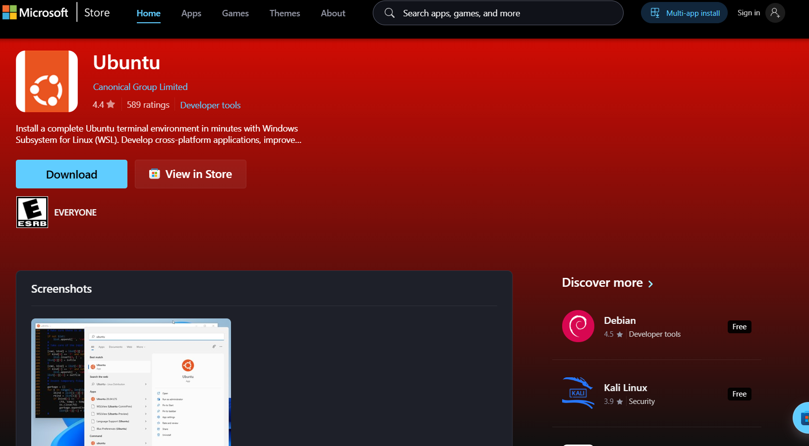
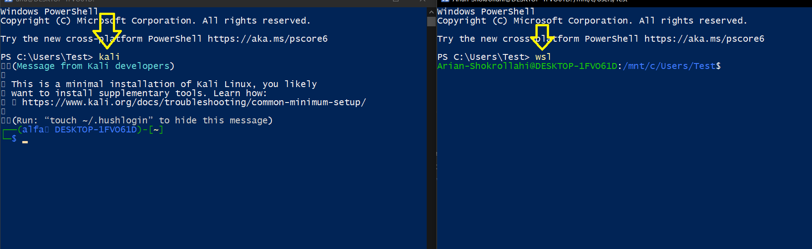

# ریختن WSL
---
## ه(WSL) یعنی چی؟
خوده کلمه ی WSL مخفف شده Windows Subsystem for Linuxکه به معنی**زیرسیستم لینوکس در ویندوز**است.ه(WSL) به تو اجازه می‌دهد داخل ویندوز، یک محیط لینوکسی مثل Ubuntu داشته باشی و دستورهای لینوکس را اجرا کنی؛ بدون اینکه لازم باشد ویندوز را پاک کنی یا حتماً VMware نصب کنی.پس کاربردش شد:
- بدون ماشین مجازی (Virtual machine)بتونی درون ویندوز لینوکس رو نصب کنی.
## در کجا میاد بعد اون WSL که میریزیم ؟
ما درون CMD & PowerShell میتونیم اون رو اجرا کنیم

---
## مراحل نصب؟
 - 1-رفتن درون Microsoft store 
 - 2-من خودم Ubuntu & Kali رو ریختم که لینکاشونو براتون میذارم
 [ubuntu](https://apps.microsoft.com/detail/9PDXGNCFSCZV?hl=en-us&gl=US&ocid=pdpshare)

	

- همانطور که مشاهده میکنید این ابونتویی که لینکشو بالا گذاشتم رو دانلود کنید و استفاده کنید

	

- اینم عکسی از اون بود که گفتم بعد دانلود open رو میزنید درون مایکروسافت استور یه خورده میگه وایسید بعد میگه username بگید و کاراشو کردید دو نصب شد بعد هر بار زدن اون اسم در PowerShell میتونید از اون linux استفاده کنید.

اینم دانلود کنید اگر میخواید wsl کار کنید باحاله.
[usefulprogram](https://apps.microsoft.com/detail/9P9TQF7MRM4R?hl=en-us&gl=US&ocid=pdpshare)
