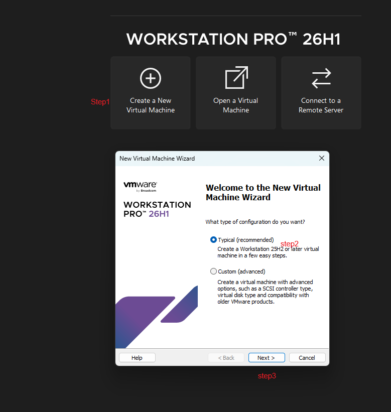
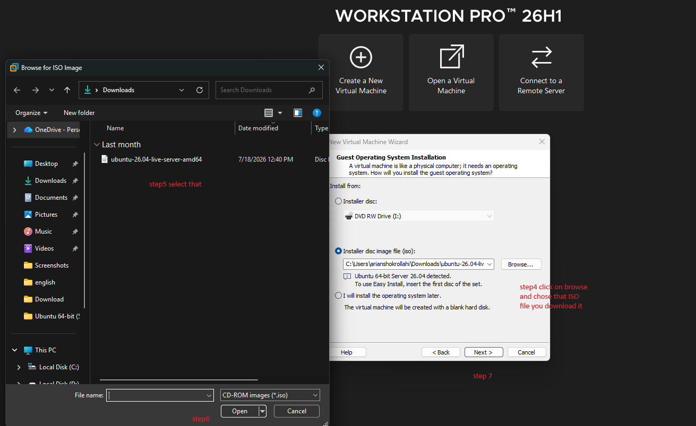
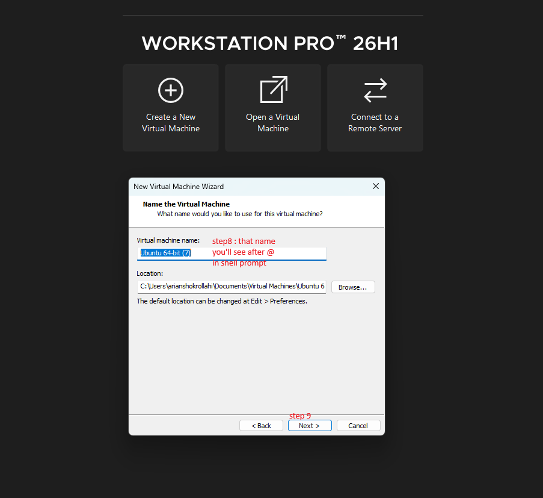
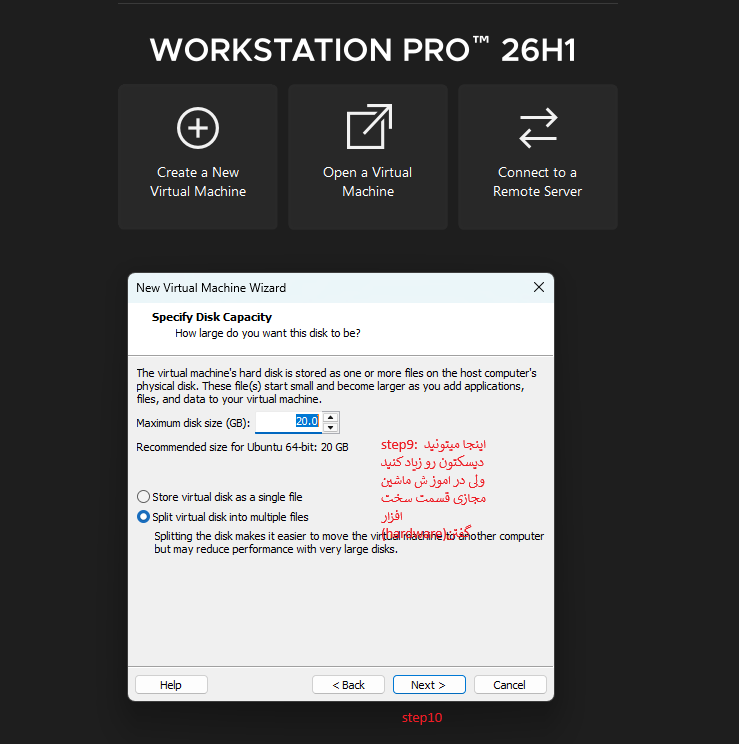

# این قسمت میخوایم به نصب لینوکس در ماشین مجازی بپردازیم:
---
## ریختن سیستم عامل مجازی رویه ماشین مجازی یعنی چی اصلا؟
یعنی شما میاید یه سیستم دیگرو درون سیستم فعلیتون شبیه سازی میکنید و میاید به اون RAM  , CPU core و.. چیزایه دیگه اختصاص میدید ، و دقیقا انگار یه سیستم درون سیستم فعلیتون دارید.

### یه مثال برایه اینکه تجسم کنید :
فرض کن کامپیوتر فیزیکی تو (لپ‌تاپت) یک «آپارتمان بزرگ» است.

وقتی ماشین مجازی درست می‌کنی، انگار داری یک «اتاق» توی این آپارتمان می‌سازی و توش یک نفر (سیستم‌عامل جدید) رو اسکان میدی. اون آدم (سیستم‌عامل) فکر می‌کنه کل خونه مال خودشه، ولی در واقع فقط از بخشی از منابع (برق، آب، فضا) آپارتمان تو استفاده می‌کنه.

---
## به چه چیزایی برایه ریختن لینوکس رویه ماشین مجازی نیاز داریم؟
- 1-شما به یک ماشین مجازی نیاز دارید که من پیشنهادم VMwareworkstation است چون  هم تنظیماتش رو به صورت کامل گذاشتم هم اینکه انعطاف پذیری بالایی دارد
[آموزش تنظیمات VMware Workstatio+n+](https://github.com/Arian-shokrollahi/virtual.machine-VMwareworkstation)

- 2-و نیاز به یک فایل ISO دارید که این فایل ISO رو حتما از سایت معتبر دانلود کنید

---
## بریم سراغه مراحلش:
- 1-اولین کار برید ماشین مجازی VMware workstation رو دانلود کنید 
- 2-برید و فایل ISO اون توزیعی که میخواید رو دانلود کنید 

	

- ا step1 میرید و create a new virtual machine رو میزنید
- ا typical رو انخاب کرده
- ا next رو میزنید

	

- اbrowse رو میزنید و میرید و اون فایل ISO که دانلود کردید رو انتخاب میکنید
- اStep5 پیداش میکنید و روش کلیک میکنید
- اopen رو میزنید و بازش میکنید
- ا next step7 میرید مرحله بعدی 

	

- ا virtual machine name اون اسمی که بعد @ در شل پرامپت میبینید چپ @ یوز نیمه راستش اسم ماشین مجازی

	

- ا step9 برای مقدار فضایه دیسکی است که میخواید به اون ماشین مجازی اختصاص بدهید اگر کم و زیاد شد مهم نیست در اموزش تنظمیاته [آموزش تنظیمات VMware Workstatio+n+](https://github.com/Arian-shokrollahi/virtual.machine-VMwareworkstation)
