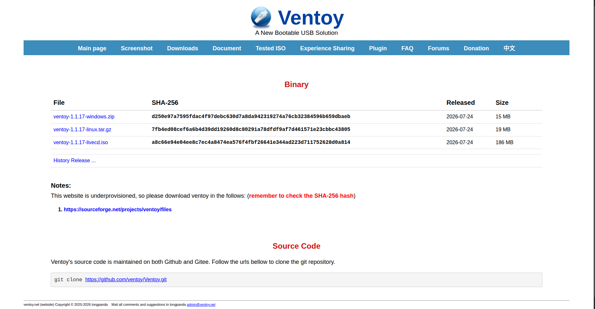
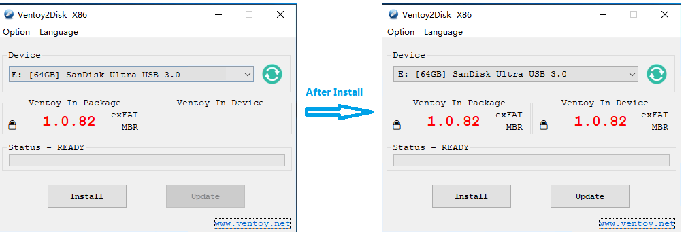
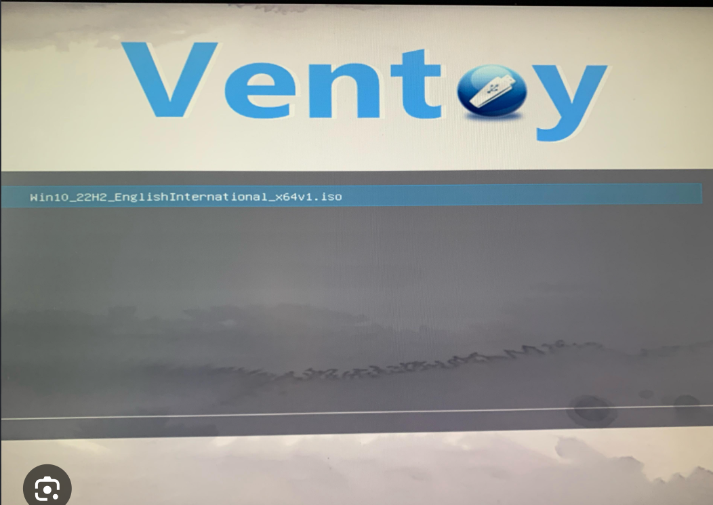
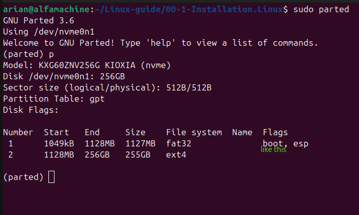

# installation linux alongside windows
# ریختن لینوکس در کنار ویندوز 
---
# چیزایی که نیاز دارید
- ۱-فلش
- ۲-نرم افزار ventoy 
- 3-و کمی فضای خالی دیسک 
- و فرض رو بر این میزاریم که ویندوز دارید و میخواهید لینوکس بریزید
- خاموش کردن bitlocker & secure boot in firmware(BIOS UEFI)
---
# 1-نرم افزار ventoy
- پیشنهادم این است که نرم افزار ventoy رو از سایت رسمی ونتوی دانلود کنید بزنید ونتوی میاره اولیشو دانلود کنید. و همچین فضایی رو درونش میبینید

	

- و رویه گزینه ویندوز بزنید 

	

 - همچین فضایی رو مشاهده میکنید که باید رویه فلشتون 
 - سپس install کلیک کنید
- و اگر اعدادی که امدن با هم برابر نبودن رویه update بزنید

---
# 2- disk management and shrink volume disk
- حالا باید برید به disk management (win+x select diskmanagement) و بخشی از دیسکتون رو shrink volume کنید 
- شرینک (shrink)یعنی کوچک شدن و شما میاید بخشی از اون دیسکتون رو کوچک میکنید
- رویه اون دیسکه خالی میزنید و گزینه shrink volume رو زده و اندازه رو انتخاب میکنید
- و باید ببنید که اون اندازه unallocated شده 
- حالا دیسکتون رو هم برایه لینوکس اماده کردید اون دیسک رو یادتون باشه چیه 
- اگر اولین sda
- دوم sdb
- سوم sdc

---
# 3-ریختن اون فایل ابونتو درون فلشی که ونتوی روش ریخته شده
- حالا شما اون فایل اون توزیع دلخواهتون رو رویه فلش میریزید

---
# 4- رفتن به میان افزار سیستمتون (BIOS UEFI)
- اگر تازگیا خریدید  UEFI  و اگر قدیمی معمولا BIOS
- رفتن به میان افزار کامپیوترتون دو حالت
- ۱- سرچ کردن BIOS KEYS  و دکمه ریستارت رو بزنید و اون BIOS KEYS هارو امتحان کنید 
- ۲-خوندن این فایل بهتون خیلی کمک میکنه و روش استانداردشو یاد میگیری[BISO UEFI](00-00-00-Readthisfirst.find.way.toenter.firmware.md)
 - رفتید رویه boot menu میزنید و فلشتون رو انتخاب میکنید

	

- یه همچین صحفه ای میاد و رویه normal boot  بزنید
- و وایسید تا اون لینوکسی که ریختید رو براتون بوت کنه

---

# 5- دیگه رفتن درون لینوکس و کارهایی که باید بکنید
- رفتید درون لینوکس لینوکس رو همون اول نریزید وترمینال رو باز کنید
- و بزنید sudo parted  
- بعدp بعد  یه همچین فلگی رو میبنید 

	

- این دستور رو بزنید -->set numberline boot off
- بعد برید و لینوکس رو بریزید و بعد صحفه میره تو بوت لینوکس میگه فلش رو دربیارید 
- درمیارید و رفتید تو لینوکس میزنید دوباره sudo parted 
- بعد روشنش میکنید--> set numberline boot on

