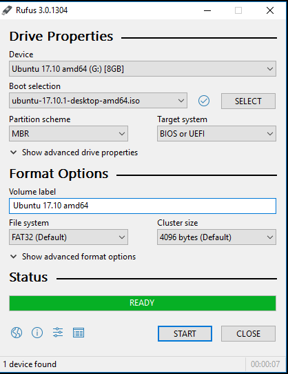

# install linux as primary os
# ریختن لینوکس به عنوان سیستم عامل اصلی

---
## نیازمندی ها
- ۱-فلش
- ۲-برنامه روفوس
- فرض بر اینه که سیستم عامل الان شما ویندوزه
- درون BIOS این گزینه Secure boot رو خاموش کنید تا در انتخاب فلشتون در boot menu  گیر نیوفتید
---
# 1- download rufus application
- برنامه روفوس رو از سایت رسمی روفوس دانلود میکنید
- بعد اکسترکت میکنید و سپس همچین فضایی بالا میاید

	

- بعد فلشتون رو انتخاب کنید  گزینه select رو بزنید بعد اون فایل لینوکستون رو از سایت هایه معتبر اون توزیع ها است رو انتخاب و سپس رویه اون فایل کلیک کنید
-  شروع رو بزنید و وایسد تا تموم شه حالا میتونید رویه هر سیستمی لینوکس بریزید
---
# 2-ا-BIOS UEFI-->Boot menu
- برایه رفتن به BIOS UEFI  کامپیوترتون این قسمت رو که اماده کردم بخونید 
- هم میتونید با BIOS KEYS برید هم میتونید این مدل استانداردی که میگم رو برید [BIOS](00-00-00-Readthisfirst.find.way.toenter.firmware.md) 
- حالا Boot menu رو انتخاب کنید و بزنید رویه فلشتون اگر secure boot فعال باشه اذیتتون میکنه off کنیدش و برید رویه فلشتون بزنید

- از اینجا به بعد هم دیگه سیستم عاملتون میشه لینوکس برید برایه نصب لینوکس
