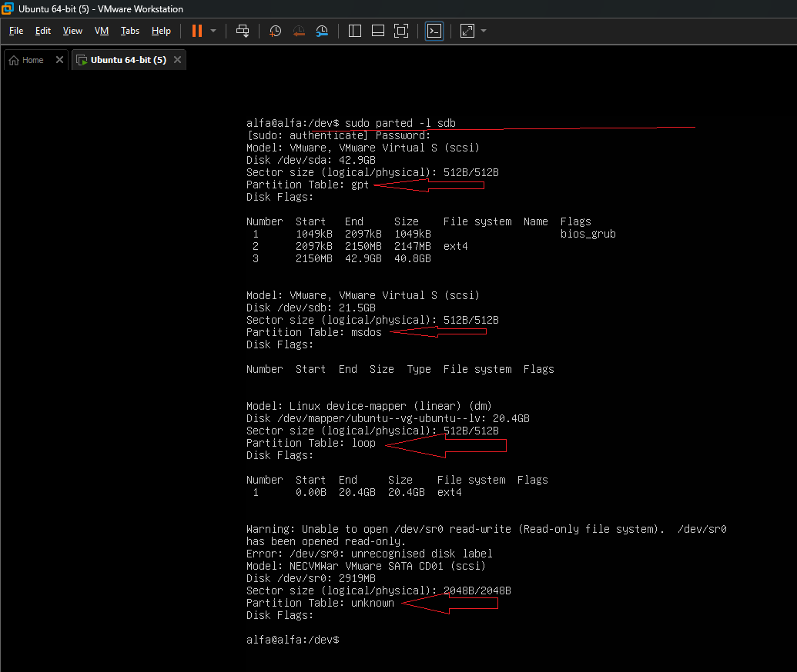
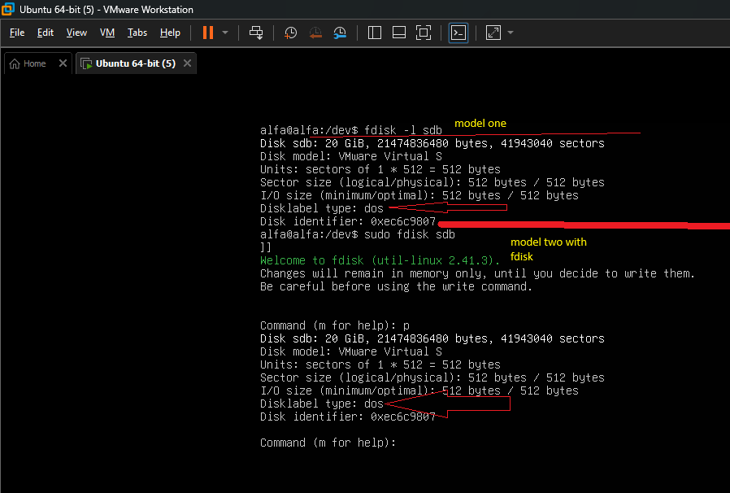

# روش هایه پیدا کردن partition table
---
## قبل از شروع این مدنظرتون باشد
- که partition table رویه disk اعمال میشه نه رویه partition
---
### با parted command
- 1-دستور --->parted -l diskpath رو بزنی بهت اطلاعات خوبی رو میده
- 2-و در بخش -->partition table به شما نشون میده که partition table شما MBR است یا GPT

<p align="center">
	
</p>
---

### با fdisk command به دو روش میتونید ببینید
- 1-با زدن fdisk -l diskpath در بخش <mark> disklabel type</mark> میتونید ببنید که اگر 

|`fdisk` نشان می‌دهد|معنی|
|---|---|

|   |   |
|---|---|
|`gpt`|GPT Partition Table|

|       |                     |
| ----- | ------------------- |
| `dos` | MBR Partition Table |
اگر **GPT** باشد، `fdisk` معمولاً می‌گوید:

```
Disklabel type: gpt
```

اگر **MBR** باشد، می‌گوید:

```
Disklabel type: dos
```

- 2-مدل دو میتونید برید تو fdisk رو بزنید --->fdisk disk path 
- بعد که زدید m رو بزنید در help که میاره با زدن p ببنید partition table رو همونطوری که در مدل دو است

<p align="center">
	
</p>
