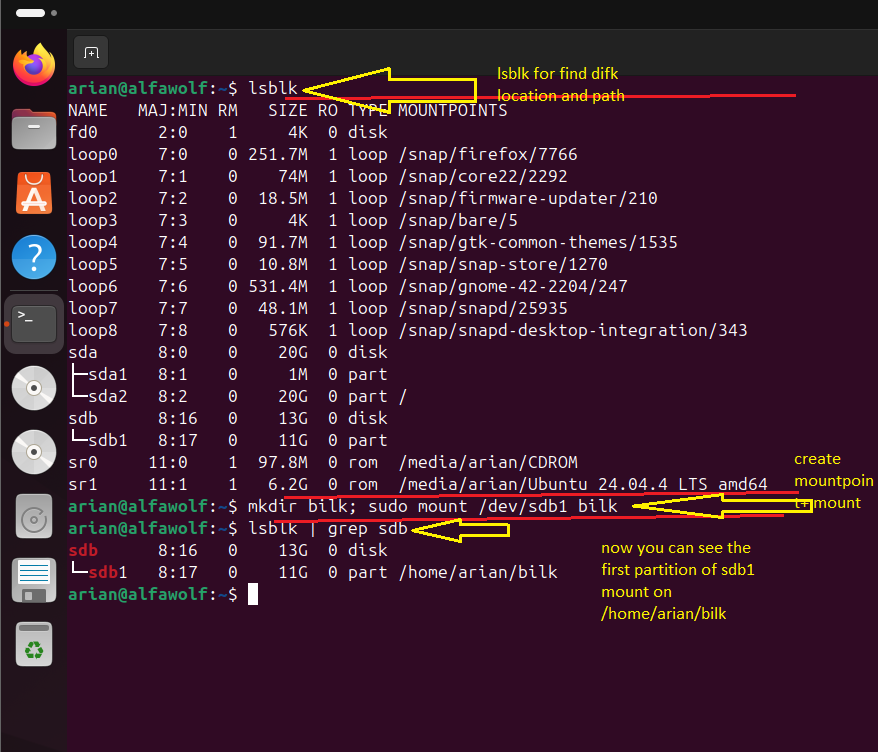

# اموزش تصویری mount کردن
---
## کارهایی که قبل از مونت کردن باید بکنید چیست؟
- پیدا کردن disk با دستور lsblk
- رفتن درون دیسک با دستور fdisk--->sudo fdisk diskpath(/dev/sda)
- ساخت جدول پارتیشن (partition table)-->for gpt -->g
- ساخت فایل سیستم رویه اون پارتیشن --> sudo mkfs.ext4 pathpartition
- وحالا بریم سراغه اینکه چه جوری میتونیم مونت کنیم
---
## مونت mount یعنی چی؟
مونت کردن یعنی ما بعد پیدا کردن دیسک با lsblk و ساخت جدول پارتیشن با fdiskو سپس ساخت پارتیشن میایم اون پارتیشنی که ساختیم رو در مسیری میاریمش داخل سیستم فایل درختی لینوکس تا توسط ما قابل استفاده شه درسته؟

---
## مراحل کارو یکبار سریع بهتون بگم 
مراحل کار دقیقاً به همین صورت است:

1. **شناسایی:** `lsblk`
2. **پارتیشن‌بندی:** `fdisk`
3. **فرمت کردن (ساخت فایل‌سیستم):** `mkfs.ext4 /dev/sdb1`
4. **مونت (Mount):** اتصال پارتیشن به یک دایرکتوری در ساختار درختی (`/`) برای قابل استفاده شدن:

```shell
sudo mkdir /mnt/mydisk
sudo mount /dev/sdb1 /mnt/mydisk
```

---
## دلیل مونت کردن
**نکته فنی:**

- لینوکس به دستگاه‌های ذخیره‌سازی به عنوان یک “Block Device” (در مسیر `/dev`) نگاه می‌کند که به تنهایی ساختار دایرکتوری ندارند.

- ا-**Mount کردن** در واقع پل ارتباطی است که محتوای آن دستگاه خام را در یک دایرکتوری خاص از درخت FHS قرار می‌دهد تا سیستم‌عامل بتواند آن را به صورت فایل و فولدر مدیریت کند.
---
## توضیح تصویر
- اون کارهارو به ترتیب کردیم
- 1-شناسایی-->lsblk
- 2-جدول پارتیشن-->partition table g
- 3-ساخته خوده پارتیشن-->partition n
- 4-ساخته فایل سیستم رویه اون پارتیشن-->mkfs.ext4
- 5- حالا میریم سراغه مونت کردن تا بتونیم در (FHS(file hirarchy system)) لینوکس به اون دسترسی داشته باشیم
- حالللااا عکسو بریم سراغش
- 1-ما میتونیم lsblk -f بزنیم من نزدم اینجا lsblk خالی زدم چون با اون کار میتونیم هم تشخیض بدیم که ایا دیسکمون پارتیشن بندی شده و هم ببنیم ایا فایل سیستمی رویه اون ساخته شده یا نه
- 2- حالا میتونیم یه پوشه بسازیم که بشه مونت پونتمون یه سوال ایا همیشه باید پوشه درست کرد؟
-جواب سوال :  **حتماً لازم نیست پوشه جدید بسازید**؛ اما **باید حتماً به یک پوشه (Mount Point) متصل شود.**می‌توانید از پوشه‌های از پیش آماده مثل `/mnt` یا `/media` استفاده کنید، ولی معمولاً پوشه اختصاصی (مثل `/mnt/mydisk`) ساخته می‌شود چون:
اگر به پوشه‌ای مونت کنید که داخلش فایل است، فایل‌های قبلی آن پوشه موقتاً **مخفی** می‌شوند. پوشه خالی، ساختار و مدیریت درخت سیستم‌فایل را تمیز نگه می‌دارد.
- و سپس پوشه رو ساخته و مونت 
- حالا اگر lsblk بگیرید در ستون اخر نشون میده که به اون مسیر که در mount کردن به عنوان mount points زدید درون اون پارتیشن اشاره میکند

<p align="center">
	
</p>

