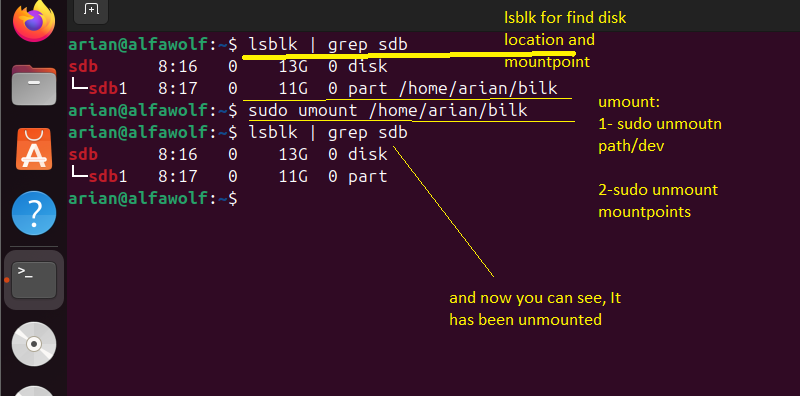

# حالا بریم سراغه unmount با دستور umount
---
## نکاته مهم قبل unmoun کردن
### 1-چرا unmount میکنیم
- برای دو دلیل اصلی:
1.  **جلوگیری از خرابی داده‌ها (Data Corruption):** داده‌های موقت داخل RAM نوشته و کش‌ها تخلیه (Flush) شوند.
2. **جداسازی امن سخت‌افزار (Safe Removal):** قطع دسترسی سیستم به دیسک تا بتوان آن را با خیال راحت کشید، خاموش یا دوباره فرمت کرد.
### 2- برای مونت کردن امن چیکار کنیم و نکات پایانی مقدمه
همیشه ابتدا **`umount` عادی** را بزنید.

- **چرا؟** دستور عادی امن‌ترین روش است؛ چون سیستم‌عامل ابتدا بافرها را تخلیه (Flush/Sync) می‌کند تا داده‌ای از دست نرود.
    
- **سوییچ‌ها (مثل `-l` یا `-f`):** این‌ها فقط “شرط اضطراری” هستند.
    
- اگر ارور **“Device is busy”** گرفتید، اول سعی کنید پردازشی که دیسک را درگیر کرده ببندید.
    
- فقط اگر موفق نشدید، از `umount -l` استفاده کنید.
    

**خلاصه:** `umount` عادی = استاندارد و امن. سوییچ‌ها = فقط در صورت شکستِ روش عادی.

---
### حالا بریم سراغه تصویر
- 1- بادستور lsblk شناسایی میکنید که اون پارتیشن در کجا مونت شده و میتونید برایه راحتی چشمتون و خوانایی زیاد grep کنید اگر اسم اون پارتیشن رو یادتون و مسیرشو 
- 2- حالا با دستور  umount شما unmount میکنید 
- 3- وحالا میتونید اون storage media رو خارج یا هر کاری که میخواید بکنید😏

	

