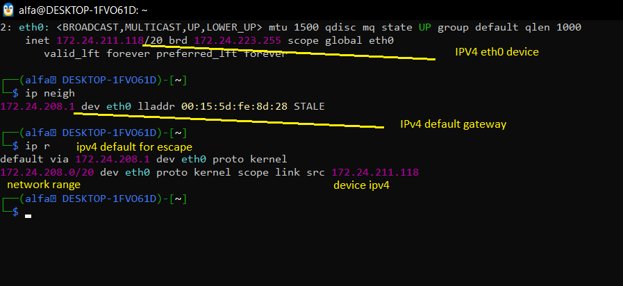

# تحلیل Network Configuration در Linux

در این مثال سه دستور مهم شبکه را بررسی می‌کنیم:

```bash
ip addr
ip neigh
ip route
```


<p align="center">
	
</p>
## تحلیل کوتاه
1.  با دستور ip -4 a(addr) show dev eth0 اومدیم IPv4(inet) رابط eth0 روپیدا کردیم
2. حالا با  ip r(route) همانطور که میبینید  خط اول درج شده ipv4 پیشفرض گیت وی
3. و اگر درخواستی به مثلا ping google.com بزنید و سپس ip neigh بزنید به شما ipv4 گیت ولی و مک گیت وی رو نشون میده چون در ip r که routing table است تعریف شده که اگر در رنج شبکه 172.24.208.0/20 نبود بفرست به دروازه یا گیت وی به ipv4 172.24.208.1 پس به همین دلیل در دستور ip neigh ipv4 گیت وی ذخیره شده


---
## تحلیل مفصل:

# بخش اول: تحلیل خروجی موجود در عکس

## 1. خروجی `ip addr`

در عکس این قسمت را داریم:

```
2: eth0: <BROADCAST,MULTICAST,UP,LOWER_UP> mtu 1500 ...
    inet 172.24.211.118/20 brd 172.24.223.255 scope global eth0
```

### اطلاعات مهم:

```
eth0
```

→ نام Network Interface

```
172.24.211.118/20
```

→ IPv4 Address + Prefix

```
172.24.223.255
```

→ Broadcast Address

```
scope global
```

→ این Address در محدوده Global مربوط به Interface است.

پس سیستم ما روی Interface `eth0` دارای IP زیر است:

```
172.24.211.118/20
```

---

## 2. خروجی `ip neigh`

در عکس:

```
172.24.208.1 dev eth0 lladdr 00:15:5d:fe:8d:28 STALE
```

### اطلاعات مهم:

```
172.24.208.1
```

→ IP مربوط به Gateway

```
dev eth0
```

→ این Neighbor از طریق `eth0` قابل دسترسی است.

```
lladdr 00:15:5d:fe:8d:28
```

→ Link-Layer Address یا همان MAC Address

```
STALE
```

→ اطلاعات Neighbor در Cache وجود دارد، اما اخیراً Reachability آن تأیید نشده است.

---

## 3. خروجی `ip route`

در عکس:

```
default via 172.24.208.1 dev eth0 proto kernel
172.24.208.0/20 dev eth0 proto kernel scope link src 172.24.211.118
```

دو Route داریم.

### Route اول:

```
default via 172.24.208.1 dev eth0 proto kernel
```

یعنی:

> برای مقصدهایی که Route مشخص‌تری ندارند، Packet را از طریق Gateway `172.24.208.1` و Interface `eth0` ارسال کن.

---

### Route دوم:

```
172.24.208.0/20 dev eth0 proto kernel scope link src 172.24.211.118
```

یعنی:

> شبکه‌ی `172.24.208.0/20` مستقیماً از طریق `eth0` قابل دسترسی است و IP مبدأ پیشنهادی `172.24.211.118` است.

---

# بخش دوم: توضیح هر بخش

# 1. `ip addr`

دستور:

```
ip addr
```

برای مشاهده‌ی اطلاعات Network Interfaceها و IP Addressهای سیستم استفاده می‌شود.

مثلاً:

```
2: eth0:
    inet 172.24.211.118/20
```

یعنی:

```
eth0
 ↓
Network Interface

172.24.211.118
 ↓
IPv4 Address

/20
 ↓
Prefix Length
```

---

# 2. `eth0`

```
eth0
```

نام یک Network Interface است.

Interface همان چیزی است که سیستم از طریق آن به شبکه متصل می‌شود.

مثلاً ممکن است داشته باشیم:

```
eth0
enp0s3
ens33
wlan0
wlp2s0
```

نکته:

```
eth0 → معمولاً Interface سیمی
wlan0 / wlp2s0 → معمولاً Interface بی‌سیم
```

---

# 3. `inet`

وقتی می‌بینیم:

```
inet 172.24.211.118/20
```

`inet` نشان‌دهنده‌ی **IPv4 Address** است.

در مقابل:

```
inet6
```

برای IPv6 استفاده می‌شود.

---

# 4. `172.24.211.118/20`

قسمت:

```
172.24.211.118
```

آدرس IPv4 سیستم است.

قسمت:

```
/20
```

Prefix Length است.

از `/20` می‌توانیم Network را به دست بیاوریم:

```
Network:
172.24.208.0/20
```

محدوده‌ی این Network:

```
172.24.208.0
        ↓
172.24.223.255
```

بنابراین مقصدی مثل:

```
172.24.212.50
```

داخل Local Network است.

اما:

```
8.8.8.8
```

خارج از Local Network است.

---

# 5. `brd`

در خروجی:

```
brd 172.24.223.255
```

`brd` مخفف **Broadcast** است.

یعنی Broadcast Address این Network:

```
172.24.223.255
```

است.

---

# 6. `scope`

در خروجی:

```
scope global
```

`scope` محدوده‌ی اعتبار Address یا Route را مشخص می‌کند.

در این مثال:

```
scope global
```

یعنی این IPv4 Address در محدوده‌ی Global مربوط به Interface قرار دارد.

در Routing نیز ممکن است ببینیم:

```
scope link
```

که یعنی مقصد مستقیماً روی همان Link قابل دسترسی است.

---

# 7. `ip neigh`

دستور:

```
ip neigh
```

برای مشاهده‌ی **Neighbor Table** استفاده می‌شود.

در مثال:

```
172.24.208.1 dev eth0 lladdr 00:15:5d:fe:8d:28 STALE
```

سیستم می‌داند:

```
IP:
172.24.208.1

MAC:
00:15:5d:fe:8d:28
```

یعنی IP مربوط به Gateway به یک Link-Layer Address نگاشت شده است.

---

# 8. `lladdr`

```
lladdr 00:15:5d:fe:8d:28
```

`lladdr` مخفف:

```
Link-Layer Address
```

است.

در این مثال این مقدار MAC Address مربوط به Neighbor است.

---

# 9. `STALE`

```
STALE
```

یکی از وضعیت‌های Neighbor است.

یعنی:

> اطلاعات Neighbor در Cache وجود دارد، اما مدتی است Reachability آن به‌طور فعال تأیید نشده است.

بنابراین:

```
STALE ≠ خراب
```

فقط یعنی اطلاعات موجود، اخیراً تأیید نشده است.

---

# 10. `ip route`

دستور:

```
ip route
```

برای مشاهده‌ی **Routing Table** استفاده می‌شود.

Routing Table به Kernel می‌گوید:

> برای رسیدن به هر مقصد، Packet را از کجا و از چه مسیری ارسال کنم؟

---

# 11. `default`

در:

```
default via 172.24.208.1
```

`default` یعنی:

> مسیر پیش‌فرض.

یعنی اگر برای مقصد موردنظر Route دقیق‌تری وجود نداشته باشد، از این Route استفاده می‌شود.

مثلاً:

```
Destination:
8.8.8.8
```

داخل Network ما نیست.

پس:

```
8.8.8.8
   ↓
default route
   ↓
172.24.208.1
```

---

# 12. `via`

```
via 172.24.208.1
```

`via` یعنی:

> از طریقِ این Next-Hop عبور کن.

در این مثال:

```
172.24.208.1
```

Gateway است.

---

# 13. `dev`

```
dev eth0
```

`dev` مخفف Device است.

یعنی:

> برای این Route از Interface `eth0` استفاده کن.

---

# 14. `proto`

```
proto kernel
```

`proto` مخفف Protocol است و نشان می‌دهد Route با چه روشی ایجاد شده است.

در اینجا:

```
proto kernel
```

یعنی Kernel این Route را ایجاد کرده است.

---

# 15. `scope link`

در:

```
scope link
```

یعنی مقصد این Route مستقیماً روی همان Link قابل دسترسی است.

مثلاً:

```
172.24.208.0/20
```

شبکه‌ی Local ماست.

پس سیستم برای رسیدن به یک IP داخل این Network، نیازی به Gateway ندارد.

---

# 16. `src`

در:

```
src 172.24.211.118
```

`src` مخفف Source است.

یعنی:

> IP مبدأ پیشنهادی برای Packetهایی که از این Route ارسال می‌شوند.

در اینجا:

```
Source IP:
172.24.211.118
```

---

# ارتباط همه‌ی این مفاهیم

حالا تمام اطلاعات را کنار هم قرار می‌دهیم:

```
                  Linux Machine
                       │
                       │
                    eth0
                       │
                       ▼
              172.24.211.118/20
                       │
                       ▼
              Local Network
             172.24.208.0/20
                       │
              ┌────────┴────────┐
              │                 │
          Local IP          Remote IP
              │                 │
              ▼                 ▼
           Direct            Gateway
                                │
                                ▼
                         172.24.208.1
                                │
                                ▼
                             Internet
```

---

# رابطه‌ی سه دستور اصلی

```
ip addr
   ↓
من چه IP و چه Interfaceای دارم؟
```

```
ip route
   ↓
برای رسیدن به مقصد از کجا بروم؟
```

```
ip neigh
   ↓
MAC مربوط به Next-Hop چیست؟
```

---

# مثال واقعی

اگر بزنیم:

```
ping 8.8.8.8
```

Kernel ابتدا Routing Table را بررسی می‌کند:

```
8.8.8.8
   ↓
آیا در 172.24.208.0/20 است؟
   ↓
خیر
   ↓
default route
   ↓
Gateway = 172.24.208.1
```

سپس برای ارسال Frame روی Local Link، MAC مربوط به Gateway را از Neighbor Table پیدا می‌کند:

```
172.24.208.1
   ↓
ip neigh
   ↓
00:15:5d:fe:8d:28
```

پس Frame اولیه به Gateway تحویل داده می‌شود.

---

# خلاصه‌ی نهایی

```
My IP:
172.24.211.118/20

Network:
172.24.208.0/20

Interface:
eth0

Gateway:
172.24.208.1

Gateway MAC:
00:15:5d:fe:8d:28
```

و منطق کلی:

```
Destination IP
      ↓
   ip route
      ↓
آیا Local است؟
   ┌──┴──┐
   │     │
  Yes    No
   │     │
   ↓     ↓
Direct  Gateway
   │     │
   ↓     ↓
Neighbor → MAC
      ↓
 Layer 2 Frame
```

## قانون طلایی

> `ip addr` → من کجا هستم؟
> 
> `ip route` → برای رسیدن به مقصد از کجا بروم؟
> 
> `ip neigh` → MAC مربوط به Next-Hop چیست؟
