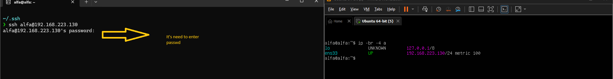
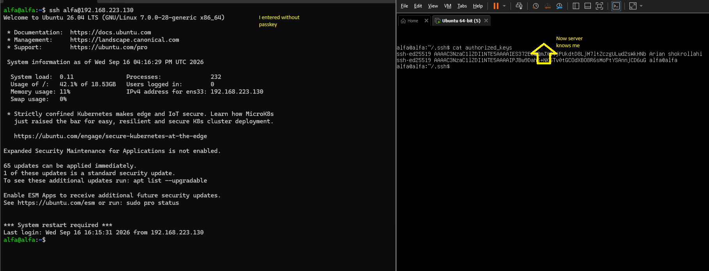

## پروژه عملی ساخت ssh-key و افزودن اون به سیستم تا هر بار فقط با زدن ssh host@ip بدون رمز وارد شید و شما رو بشناسه
---
## چی قراره بخونیم

- اول در تصویر دو لینوکس است چپی رویه WSL راستی رویه virtual machine راستی server ماست و ما میخوایم بهش وصل شیم 
- در حال عادی --> ssh host@ip شما + وارد کردن رمز سرور شما به سرور وصل میشوید 
- حالا ما میخواهیم مارو به خواطر بپسپاره و هر سری که میخوایم با ssh(secureshell)وارد سرور شیم ما رو بشناسه و رمز نخواد اینجاست که نیار داریم به  ssh-copy-id + ساخت keygen همونی که با پسوند .pub بود و معمولی 
- و اونی که در سروره چجوری بفهمه اون کلید ssh ماله کیه
---
## بریم سراغه درست کردن و اموزش

1.  شما همانطور که میبیند ما دو تا ترمینال چپی WSL راستی هم سرور ماست در ماشین مجازی
<p align="center">
	
</p>

---
2. حالا شما میاید ssh key درست میکنید با command ssh-keygen 
- ا-ssh-keygen دستور ساخت ssh key
- ا-t برای اینکه از مدل ed 25519 میریم ما 
- ا-C برایه اینکه comment میزاریم
- ا-f هم اون اسم دلخواه رو برایه کلید بزاریم


<p align="center">
	
</p>
3. درست که کردید با دستور keygen و اون گزینه ها شما میرید سراغه پوشه ssh. که مخفی است درون ~ بعد ببنید یه فایلی با پسوند .pub درست شده که کلید عمومی شما و اونی که پسوند pub. نداره کلید خصوصی که اونو نباید در اختیار کسی یا جایی بزارید 
4. حالا که ساختید یکبار تست میکنیم که به سرور وصل شیم

<p align="center">
	
</p>
5. همانطور که میبینید برایه وصل شدن به سرور password سرور رو میخواد
6. اینجاست که میایم و اون public key رو کپی و دیگه رمز سرور رو وارد نمیکنیم و مارو میشناشه و درون authorized-key مار رو به خاطر میسپاره

<p align="center">
	
</p>
7.  حالا همانطور که میبیند بدون رمز وارد شدیم و در هاست در 
```
~/.ssh/authorized-key
```
8. مارو به خاطر سپرده

---
