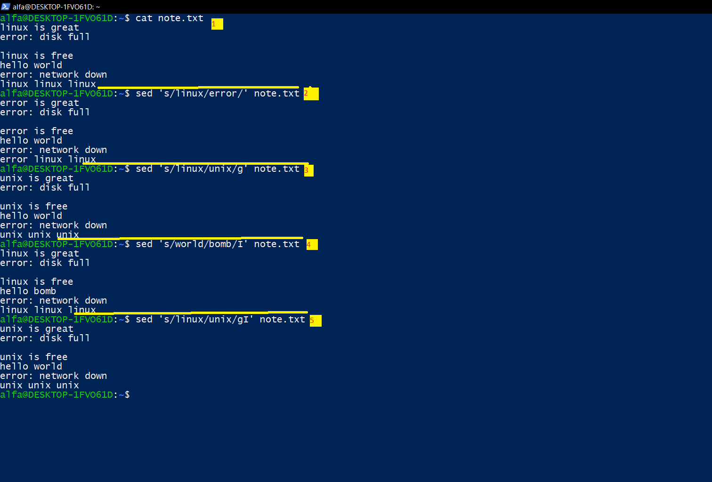
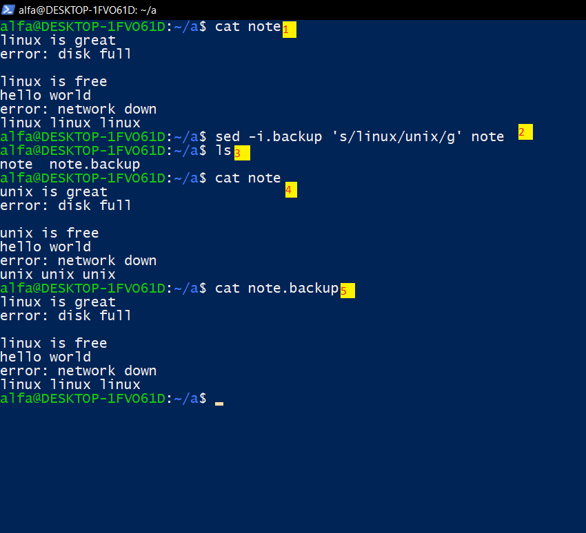

# lesson 20 section 03 sed command
## Introduction to sed command
## دستور (sed)چیست و چیکار میکند ؟ 
- دستور (sed) یه ویرایشگر متن غیر تعاملی است( Non-interactive text editor)است که مخفف  (stream editor).
- غیره تعاملی یا (Non-interactive)یعنی چی یعنی این دستور مانند ویرایشگر های متنی تعاملی (Interactive) مانند این چند مورد-->vscode , nano , vim کنترل ترمیناله شما رو نمیگیره بده دست برنامه و شما درهمون شلی هستید میتونید تغییرات رو اعمال کنید.

## تفاوت Interactive & Non-interactive
- تعاملی(Interactive)-->برنامه هستند مانند **نکته** همچیز در لینوکی برنامه یا پردازه است حتا دستور هایی که ما استفاده میکنیم . مانند: (less , vi, nano , vscode) که کنترل ترمینال رو به دست میگیرند تا ازشون خارج نشی کنترل رو بر نمیگردونن.

- غیرتعاملی  (Non-interactive) -->بدون در دست گرفتن کنترل ترمینال کارشون رو انجام میدن در همون پرامپ فعلی و بلافاصله نتیجشو بهتون در خروجی نشون میدن

---

## چیکار میشه کرد با این دستور:
1-جایگزینی متن (subtitution) : --->فقط در خروجی نشون میده و ولی واقعا این اتفاق نمیوفته---->                                  s/pattern/replacement/flags 
-  اولین قسمت (pattern) چیزی که میخواهی پیدا شود
- دومین قسمت (replacement)چیزی که میخوای جایگزین شود
- چهارمین قسمت (flags)گزینه  ها مثل  I , g ,N و غیره.

معمولا در قسمت(subtitution)-->این مدل ها استفاده میشه :
- sed 's/old/new ' filename ==> avalin patterni ke dar har khat peyda mishe
- sed 's/old/new/g' filename==> hame pattern ha dar hame khotot
- sed 's/old/new/I' filename==>flag I ignor case mikonad
- sed 's/old/new/gI' filename==>ham ignorcase & hame pattern dar hame khototf

  

---
2-اگر میخواید این تغییرات دستور sed در فایلتون ذخیره شود باید از گزینه ی -i استفاده کنید، که ساختارش به این صورت است.
- sed command structure--->sed -i.backup 'on kar mesle->'s/patternikehast/mikhayjayegozin/flags' filename

که در اینجا فایلی به اسمه filename.backup تشکیل که محتوا فایل اصلی رو توش که اگر اشتباه شد بتونی فایل قبلیتو ببینی و خوده فایلت هم به اسمه filename  تغییر میکند.

  

## توضیح عکس روبرو :
- 1 محتوا فایل note رو مشاهده میکنید
- 2 این امن ترین راه استفاده از دستور sed میباشد
- 3 لیست که میگیرید یه فایل backup هم اضافه شده به دیلی backup. که زده بودید
- 4 و 5 هم که مشاهده میکنید فایل اصلی تغییر فایل note.backup همون محتوا فایل قبلی

  ---
  ### مثال هایه بیشتر درمورد دستور sed:
##### فایلی داریم به اسمه a که به ترتیب این کلمات در سطر   1aria n 2ali 3mehdi 4niyosh 5ali 
- 1-چاپ دقیق یک سطر ----->sed -n 'number+p' filename
-  for print ali in line four(4)j---->sed -n '4p' a---->show ali in stdout

- 2- تغییر فقط یک سطر خاص------------------>sed 'nmuberline+s/old/new' file name
- for change ali(in line 5) to mamad-->sed -n '5s/ali/mamad' a
- another model $(lastline)--->sed -n '\$s/ali/mamd/' a

- 3- در خطی که aria هست  n  رو به x تبدیل کن
- sed '/arian/s/n/b/' a

  ---
  # هر دستوری گزینه و اینا زیاد دارم من چیزایی که مهمه رو میگم اضافه تر خواستید مطالعه کنید man sed رو بزنید😘.
