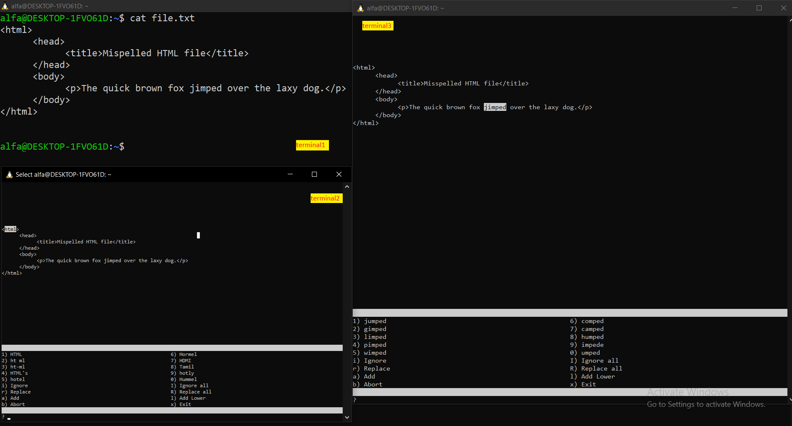

## introduction to this command
# دستور aspell چیست؟

دستور aspell دستوری است تعاملی که برایه اصلاح کردن غلط املایی استفاده میشود و اگر با دستور قدیمی ispell کار کرده باشید این دستور جایگزین اون دستور محسوب میشه.

## سازوکار این دستور به چه شکل است؟

سازوکار دستور `aspell` به این شکل است که هنگام رسیدن به کلمه‌ای با غلط املایی، برنامه روی آن کلمه متوقف می‌شود و در محیط تعاملی، چند پیشنهاد نمایش می‌دهد. این پیشنهادها کلماتی هستند که احتمال می‌رود منظور شما باشند. اگر یکی از پیشنهادها درست بود، عدد مربوط به آن را وارد می‌کنید تا کلمه جایگزین شود و برنامه به خطای بعدی برود. اگر کلمه را نمی‌خواهید تغییر دهید، می‌توانید با فشردن `i` آن را نادیده بگیرید و به مورد بعدی بروید. با فشردن `I`، همهٔ موارد مشابه آن کلمه در فایل نادیده گرفته می‌شوند.

---

# بریم یه مثال از این دستور رو ببینیم

  

