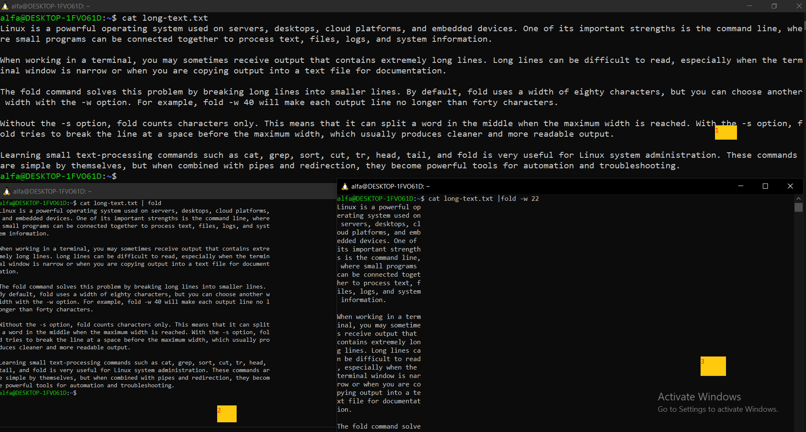

# lesson 21 section 02-01 fold command
# ا <mark>دومین</mark> دستور درس21 دستوره fold
---

## دستور fold چیست و چیکار میکند؟
دستور `fold` برای **شکستن خط‌های بلند متن** در یک عرض مشخص استفاده می‌شود.

این دستور زمانی کاربرد دارد که یک فایل یا خروجی دستورها دارای خط‌های خیلی طولانی باشد و بخواهیم آن‌ها را خواناتر یا مناسبِ نمایش در ترمینال کنیم.

به‌صورت پیش‌فرض، `fold` متن را در عرض **۸۰ کاراکتر** می‌شکند.

## بریم مثالی از دستور  fold ببینیم:
- فرض کنید فایلی به اسم long-text.txt داریم و میخواهیم اون رو به صورت خوانا نمایش بدیم میتونیم چند کار کنیم:
- -از دستور fold استفاده میکنیم ولی دستور fold پیش فرض رویه 80 کاراکتر عرض رو میشکنه و میره خط بعد اگر بخواهید عدد دلخواهتون رو برایه شکست عرض  بزارید باید از گزینه -w استفاده و گزینه s- رو هم بزارید تاکلمات نصف نشوند

  

- بخش 1- همانطور که در بخش 1 میبینید در حالت عادی فایل انقدر کثیف چاپ میشه
- بخش2- در بخش دوم اومدیم خروجی رو دادیم به دستور fold و این دستور برد رو پیشفرض 80 کاراکتر این فایل رو
- بخش3- اینم برایه همون جوری بود که گفتیم اگر میخواهیم بر اساس کارکتر مد نظر خودمون شکسته شه از گزینه -w استفاده می

  ---

# ا <mark>سومین</mark> دستور این فصل دستور ftm است که اون هم مثل دستور ftm همون کاره مرتب کردن پاراگراف هارو میکنه.
