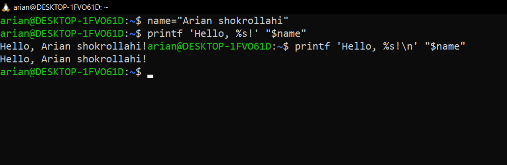
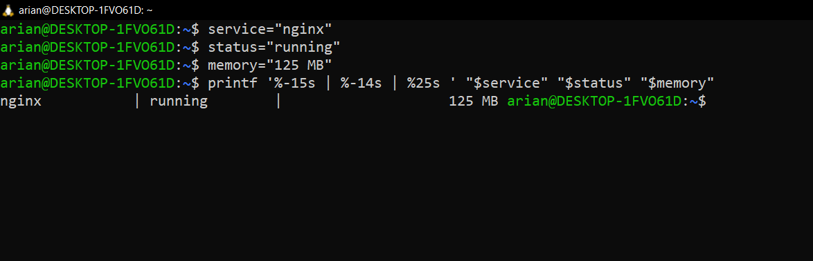

# lesson 21 section 03<mark> printf</mark> command
---
## دستور printf چیست ؟
دستور printf دستوری است که در لینوکس و شل برای چاپ کردن متن با قالب بندی دقیق استفاده میشه.

# به چه دستوری دستور printf شباهت دارد و کدوم بهتره؟
دستور printf به دستور echo شباهت دارد و هر دو برایه نمایش و چاپ کاربرد دارن ولی echo خیلی ساده تر از دستور printf است چون echo فقط متن رو نشون میده ولی با printf میتونید مشخص کنید که:
- متن چگونه نمایش داده شود
- چند عدد رقم اعشار یا float رو نشون بده
- ستون ها مرتب باشند
- متغیر ها با فرمت دلخواه چاپ شوند
- میتونیم حالت عادی در parintf از escape sequence ها استفاده کنیم در حالی که برای echo باید از گزینه   e- استفاده کنیم.

---
## قبل شروع توضیح ساختار دستور printf اینارو یه نگاه بندازید
- 1-مقایسه printf & echo
```
ویژگی	      echo	  printf
چاپ ساده متن	    ✅	    ✅
خط جدید خودکار	    ✅	    ❌
 دقیق فرمت    	محدود    ✅
ساخت جدول    	  ضعیف	✅
کنترل اعشار	    ❌	    ✅
صفرگذاری عدد	    ❌	    ✅
مناسب <--اسکریپت حرفه‌ای	گاهی	✅
```
- معرفی و کارکرد هر escape sequence character
```
Escape	معنی
\n	رفتن به خط بعد
\t	tab یا فاصلهٔ ستونی
\\	نمایش یک بک‌اسلش
\"	نمایش double quote
\r	برگشت به ابتدای همان خط
\a	صدای هشدار ترمینال (اگر فعال باشد)
\v	vertical tab
\b	backspace
```
---
## حالا بریم سراغ اون قسمت هایه مهمه دستور printf.
<mark>- printf command structure</mark> -->printf "format" value
- <mark>Detailed structure</mark> -->structure-->%\[flags]\[width]\[.presicion]specifier
# حالا بریم سراغ توضیح قسمت هایه مختلف این دستور
#### 1 اینکه شما دستور printf  رو مینویسید دابل کوت باز میکنید و درون اون اگر میخواید از sspecifier  ها و  flags ها استفاده باید یه % بزارید و اون specifier  هایی که جلوتر یاد میدم رو استفاده کنید و به این دقت کنید که
```
%   flags   width   .precision   specifier
---
printf "%-08.2f\n" 12.5
---
%   -   0   8   .2   f
│   │   │   │    │   └─ specifier: عدد اعشاری
│   │   │   │    └──── precision: دو رقم بعد از ممیز
│   │   │   └───────── width: حداقل ۸ کاراکتر
│   │   └───────────── flag: پر کردن با صفر
│   └───────────────── flag: چپ‌چین
└───────────────────── شروع format

```

#### بریم سراغ <mark>specifier</mark> ها`


- %s -->string
- %d-->desimal number
- %i ---> like %d print number 
- %f--->float number (اعشاری)
- %x --->print in base-16(hexadecimal)
- %o--->print in base-8(octal)
- %c--->print one char
- %\%--->print percent sign%

#### بریم سراغه قسمت بعدیش که<mark> flags </mark>که قبل specifier میاد
| Flag        | توضیح                                                                                                                      |
| ----------- | -------------------------------------------------------------------------------------------------------------------------- |
| `-`         | مقدار را در عرض تعیین‌شده **چپ‌چین** می‌کند.                                                                               |
| `+`         | علامت عدد را همیشه نمایش می‌دهد؛ مثبت با `+` و منفی با `-`.                                                                |
| ` ` (space) | قبل از عدد مثبت یک فاصله قرار می‌دهد؛ عدد منفی همچنان با `-` نمایش داده می‌شود.                                            |
| `0`         | فضای خالیِ قبل از عدد را با `0` پر می‌کند؛ معمولاً همراه با `width` استفاده می‌شود.                                        |
| `#`         | حالت جایگزین (**alternate form**) را فعال می‌کند؛ مثلاً برای hexadecimal پیشوند `0x` و برای octal پیشوند `0` اضافه می‌شود. |

---

# دیگه خیلی درمورداین دستور صحبت کردیم🤯 و همینقدر واقعا کافی است و کارو برایه شما در میاره😉بیشتر خواستید سرچ بزنید ولی به عنوان پیشنهاد اینو بهتون بگم خوبه ادم وقت بزاره و یاد بگیره ولی واقعیتش اینه که خیلی یاد گرفتنم خوب نیست سعی کنید چیزایی که یاد میگیرید رو عملی کد بزنید تا تثبیت شه تو ذهنتون.
### این درسم زیاد توضیح ندادم اگر ببنید مثلا escape char هارو در درس هایه قبل درموردشون گفته بودیم هم دوره ای از اونا بود هم مطالبه پیش نیازه این دستور رو کنار هم قرار دادیم
---
## بریم و سه مثال از کاربرد دستور printf ببینیم:

 1- مثال اول 
 <p align="center">
	 
</p>
- اگر هدفتون برنامه نویسی است و برایه این لینوکس رو یاد میگیرید در جلوتر با مفهوم bash scripting اشنا میشید که باید رویه کلی چیز تسلط داشته باشید برای اسکریپت نویسی مثلا--->چاپ امن و درست متغیر هارو باید با دستور printf یاد بگیرید .
- االان ما متغیری ساختیم name="Arian shokrollahi" حالا میخوایم اون رو با عنوان Hello, name! چاپ کنیم  دوستان echo هم خوبه ولی برایه اسکریپت نویسی و نشون دهنده تسلطتون روی ترمینال اینطوری واقعا امن تر و حرفه ای تره.

**دلیل گذاشتن n\\** -->ما در فصل قبل درباره فرق ms-dos file&unix file صحبت کردیم که گفتیم ماکه enter میزنیم به صورت نامرعی به اخر خط در یونیکس سیستم ها n\ (LF) اضافه میشد و به فایل هایه ویندوزی بر اساس سنت قدیمی  dos -->(\\r\\n(CRLF)) اضافه میشد.

 <p align="center">
	 
</p>
کاربرد: نمایش اطلاعات سرویس‌ها، کاربران، فایل‌ها، IPها یا منابع سیستم به‌صورت مرتب در Bash script.

- `%-15s` → متن را در فضایی با عرض ۱۵، چپ‌چین می‌کند.
- `%-10s` → متن را در فضایی با عرض ۱۰، چپ‌چین می‌کند.
- `%10s` → متن را در فضایی با عرض ۱۰، راست‌چین می‌کند.

---
# همینارو مسلط باشید عاللللیهه ولی سرچم ضرری ندازه ولی اینایی که در این بخش گفتیم چکیده ی خفنی از دستور printf بود😪🥱موفق باشید
