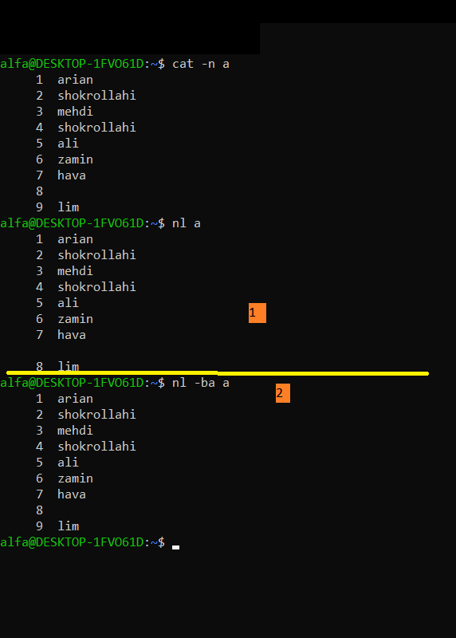
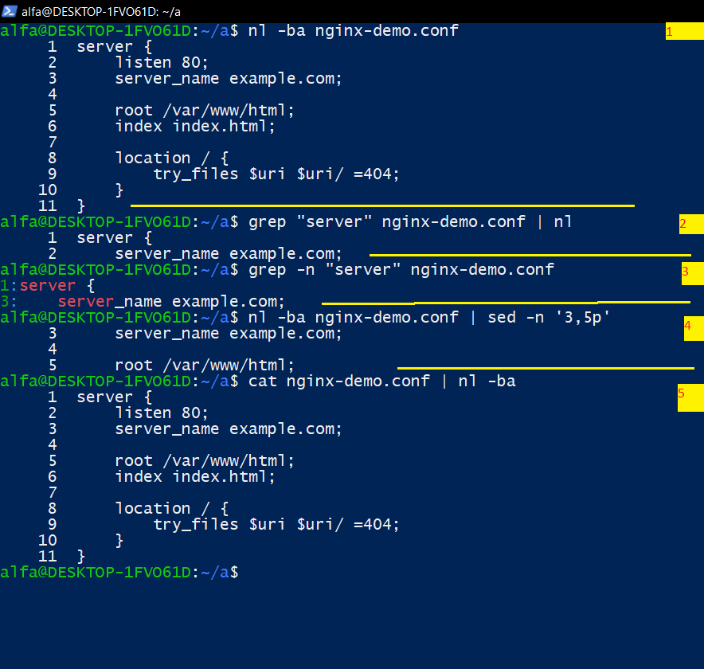
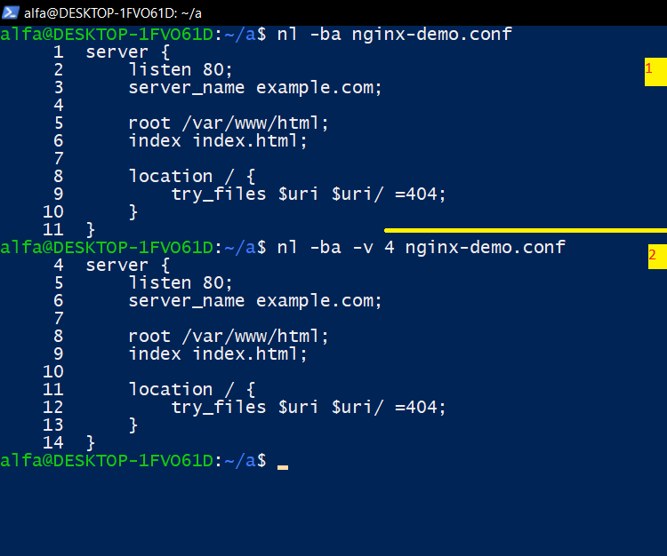

# lesson 21 section 01 nl command
# اولین دستور درس 21 دستوری نیست جز دستور nl  .

## دستور `nl` چیست؟
دستور nl مخفف **Number Lines** است؛ یعنی خطوط ورودی یا یک فایل را شماره‌گذاری می‌کند.

## این دستور با چه دستوری شباهت دارد؟

- 1 این دستور شبیه دستور (cat -n filename) است با این تفاوت که (cat -n) همه خطوط رو نشون میده حتی خطوط خالی رو ولی  دستور  nl  به طور پیش فرض فقط خطوط غیر خالی رو نشون میده.
- 2 اگر میخواهید این دستور هم همه خطوط رو نشون بده از گزینه ba- استفاده کنید.

  

---
## (1)بریم سراغ کاربرد دستور  nl  (چند کاربرد ساده)؟

اول فایلی به اسم nginx-demo.cnof میسازیم و مثلا یه محتوایی که در عکس پایین نشون دادم رو بهش اضافه میکنیم. حالا بریم سراغ کاراهایی که توش دستور nl کمک میکند:
- 1- شماره گذاری خطوط حتی فاصله ها --->                                         
nl -ba nginx-demo.conf     
- 2-1فایلی رو grep میکنید سپس میاید اون رو شماره گذاری میکنید---> 
grep "on chiz" nginx-demoe.conf | nl
- 2-2 اگر میخواهید شماره خط واقعی اون الگو در اون فایل رو ببینید از --->
- grep -n "onchiz" filename
- 3-نمایش بازه ای از خطوط--->
nl -ba nginx-demo.conf | sed -n '3,5p'
- 4- کاره اصلی دستور nl---> این است که دستور برای این استفاده میشه که  از دستور  cat, grep....استفاده میکنی تهش یه pipeline درست کنی و یه  nl -ba بزنی تا شماره خطوطو بده.
cat nginx-demo.conf | nl -ba

  

---
## (2) من به صورت خلاصه و کوتاه توضیح دادم البته همین هارو بلد باشید 90% داستان رو بلدید✔ ولی باز اگر خواستید گزینه هایه بیشتری رو یاد بگیرید از دستور ---> man nl استفاده کنید .

---
## (3) حالا چندتا از گزینه هایه مهم رو بهتون بگم.
- 1- اولین گزینه مهم گزینه (ba-)--> شماره گذاری + خای هارو هم حساب میکند
nl -ba file.txt
- 2-دومین گزینه مهم گزینه (v- NUMBER)--->
nl -ba -v number file.txt

  

