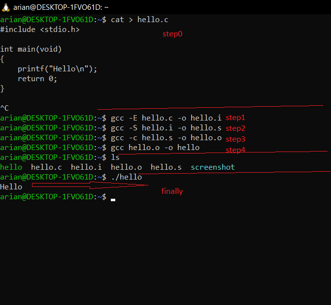
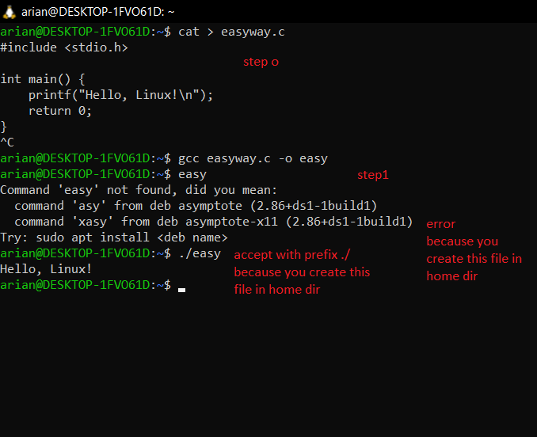
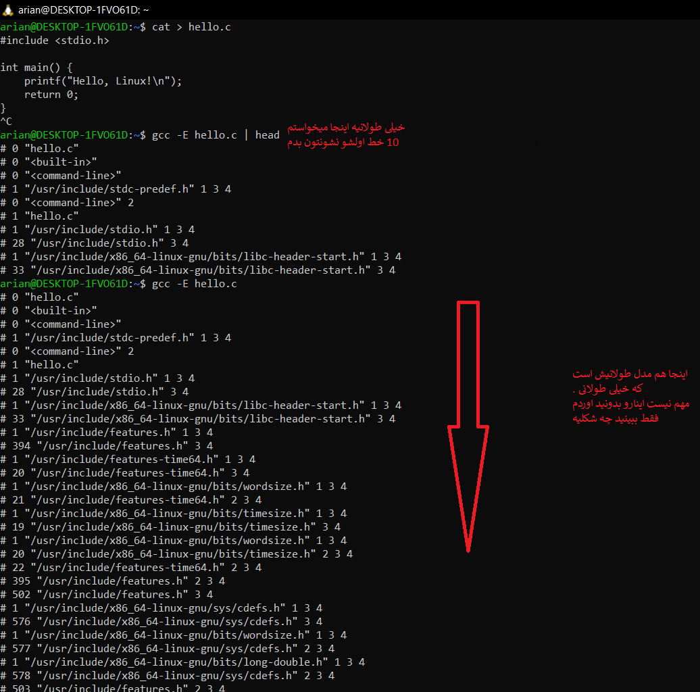
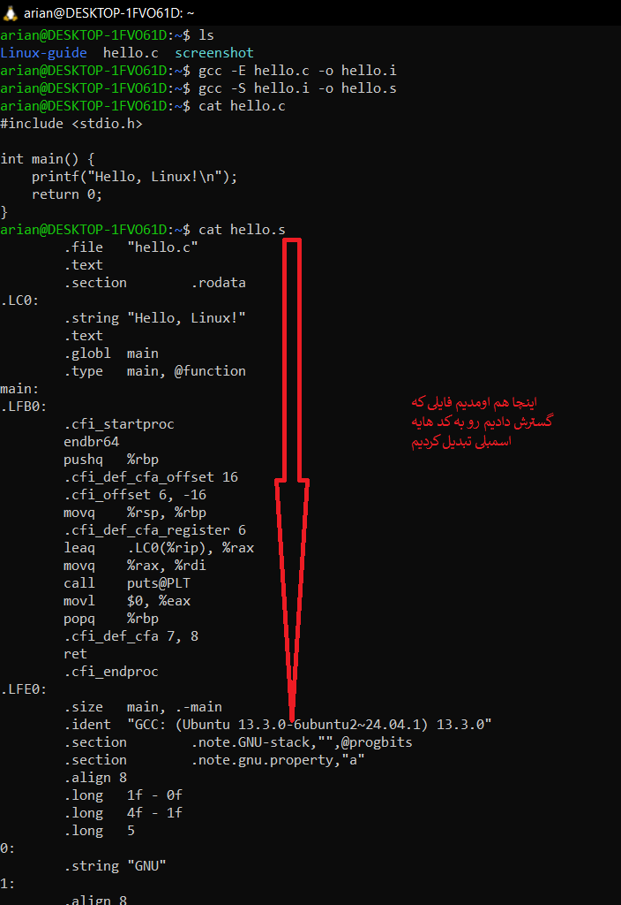

#  یادگیری تبدیل سورس کد  زبان C به برنامه ای قابل اجرا:
اول اینکه برای تبدیل سورس کد C به برنامه ی اجرایی ما باید 6 مرحله رو طی کنیم:
- ا <mark>تبدیل سورس کد C به برنامه ای قابل اجرا مدل اول که خودتون باید دستی کاراشو بکنید</mark>
- 0-Step0(source C file): on khat kod haye zabane c ke mirizid
- 1-Step1(preprocess): gcc -E filename.c -o filename.i
- 2-Step2(tabdil be zaban assembly): gcc -S filename.i -o filename.s
- 3-Step3(tabdil assembly be objfile): gcc -c filename.s -o filename.o
- 4-Step4(linkfile & create executefile): gcc filename.o -o filename

- ا <mark>این نکته رو درنظر بگیرید که همیشه نیاز به انجام تمام این مراحل نیست دقت کنید که:</mark>
- (1)مدل یک یا میتونید این 5 مرحله مدل یک رو برید
- (2)یا از gcc خالی استفاده کنید بدون هیچ گزینه ای تا 5 مرحله رو در براتون بره بدون دشواری

---
# بریم سراغ مثال هایی که با اون ها بتونیم سورس کد زبان C رو کامپایل کنیم
-  ا<mark>مدل 1 مدل سخته</mark>


<p align="center">
	
</p>

- قدم 0 داشتن فایلی با script زبان c
- قدم 1 تبدیل فایل با -E به فایل گسترده تر
- قدم 2 تبدیل فایل گنده با -S به  assembly 
- قدم 3 تبدیل اسمبلی با توسط اسمبلر -c به کد ماشین
- قدم 4 لینکر میاد  نیاز هارو دانلود میکند
- حالا فایل اجرایی hello قابل استفاده چون در محیط home ساختیدش   قبلش /. بزارید .

--
- ا<mark>مدل2 مدل اسونه</mark>

<p align="center">
	
</p>

- مرحله 0 سورس کد  C رو میخواید
- مرحله 1 gcc -sourcecode.c -o nameprogram و به همین راحتی بدون نیاز به این 4 مرحله شما برنامه ساده ای با c ساختید که  hello, linux! رو براتون میاره
- این error هم بالا توضیح دادم به دیلی اینکه این برنامه c رو در پوشه خونگی تون کامپایل کردید قبلش باید /. بزارید

---
# توضیح اون مراحل مدل سخته اگر خواستید بدونید چیشد که این شد 🤨 :
## 1️⃣ پیشپردازنده (Preprocessor)

وقتی دستور `gcc` را اجرا میکنی، **اولین قدم**، پیشپردازنده است.


`gcc -E hello.c`
-درون این قسمت preprocess یا پیش پردازش رو انجام میده و اگر خروجیشو ببینید به یه فایل خیلی بزرگ تبدیلش میکند
<p align="center">
	
</p>


## 2️⃣ کامپایلر (Compiler)

`gcc -S hello.c`

### اینجا چه اتفاقی میافتد؟

کد C (که حالا آماده و بزرگتر شده) به **کد اسمبلی** تبدیل میشود. خروجی فایلی مثل `hello.s` است که دستورهای `MOV`، `ADD` و… دارد.

<p align="center">
	
</p>

## 3️⃣ اسمبلر (Assembler)


`gcc -c hello.c`

### اینجا چه اتفاقی میافتد؟

کد اسمبلی را به **کد ماشین (باینری)** تبدیل میکند. خروجی فایلی به نام `hello.o` است (Object file).

### نکته مهم:

- `hello.o` فایل **باینری** است، ولی **هنوز قابل اجرا نیست**!
- چون ممکن است به چیزهایی نیاز داشته باشد که هنوز وصل نشدهاند (مثل تابع `printf` که در کتابخانه است).
## 4️⃣ لینکر (Linker)


`gcc hello.o -o hello`

### اینجا چه اتفاقی میافتد؟

- لینکر میآید و `hello.o` را میگیرد.
- میبیند برنامه به `printf` نیاز دارد.
- آن را از **کتابخانهٔ استاندارد C** (مثلاً `libc`) پیدا میکند.
- همهچیز را به هم وصل میکند (لینک میکند).

### خروجی:

فایل `hello` که حالا **کاملاً executable** و قابل اجراست.
```
./hello

خروجی:

Hello, Linux!
```
