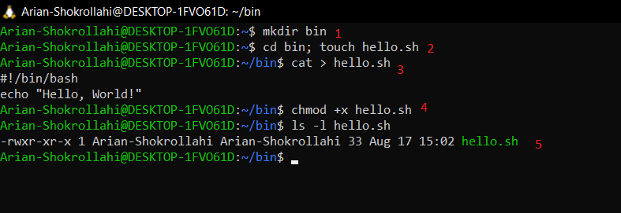
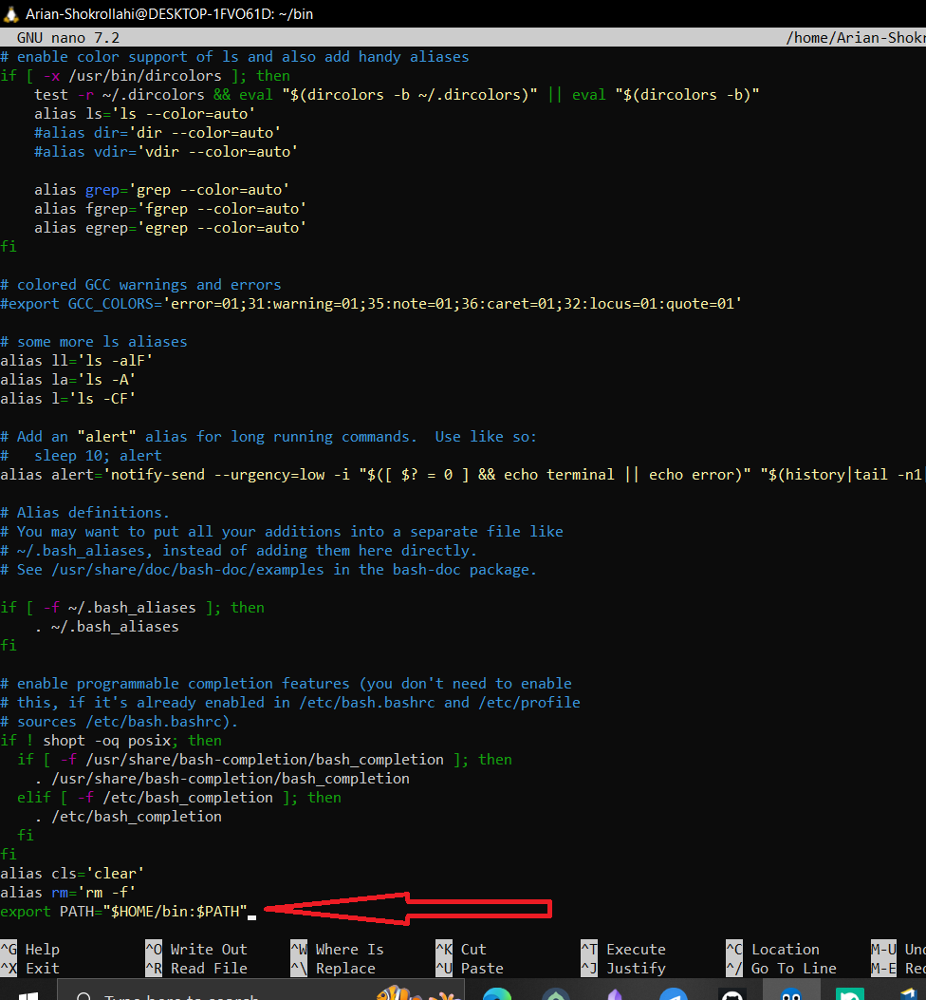
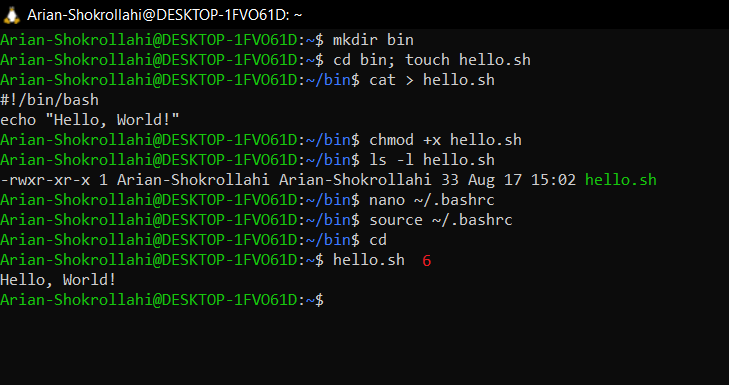

## در این درس به چه خواهیم پرداخت ؟
در این درس به معرفی و توضیح مقدمات اسکریت نویسی میپردازیم و هرچه جلو میرویم  کار رو جدی میکنیم و اسکریپت هایه بیشتری رو یاد میدهیم.

## شل اسکریپت (shell script) چیست ؟
- یک فایل متنی که توش چندتا دستور پشتسرهم نوشته شده.
- و وقتی اسکریپت رو اجرا میکنی، شل دستورات رو **دقیقاً مثل وقتی که دستی تایپشون کنی** اجرا میکنه.
## دلیل استفاده از شل اسکریپت(shell script)؟ 
تا اینجا دستورهای زیادی یاد گرفته‌ایم. اگر لازم باشد هر روز تعداد زیادی دستور را به‌صورت دستی وارد کنیم، هم خسته‌کننده است و هم زمان زیادی می‌گیرد. علاوه‌براین، احتمال اشتباه‌کردن در واردکردن دستورها نیز بیشتر می‌شود.
راه‌حل این است که این **دستورها** را داخل یک فایل متنی بنویسیم و آن فایل را به‌صورت یک برنامه اجرا کنیم. به این فایل، **اسکریپت (Script)** می‌گویند.

---

# نحوه ی نوشتن اسکریپت شل ؟
ا<mark>برای نوشتن یه اسکریپت شل موفق باید این کار هارو بکنی </mark>
- ا<mark>(1)نوشتن اسکریپت </mark>
- نوشتن اسکریپت هایه شل  که برایه نوشتن یه اسکریپت خوب نیاز به یه ویرایشگر متن خفن داریدکه خاصیت رنگ امیزی سینتکس (syntax highlighting)داشته باشد مثل : vim رو پیشنهاد میدم بهتون.
- ا <mark>(2)اجرایی کردن اسکریپت </mark>
- سیستم به صورت عمدی اجازه نمیده هر فایل متنی ساده ای به عنوان برنامه اجرا شود و دلیل خوبی هم دارد  چون باید مجوز (Permission) اجرا را برای فایل اسکریپت تنظیم کنید.
- ا<mark>(3)قرار دادن اسکریپت در مسیری که شل بتواند اون رو پیدا کنید</mark>
- شل به صورت خودکار در مسیری خاصی و دایرکتوری هایه خاصی دنبال فایل هایه اجرایی میگرده که برای راحتی شل باید اسکریپت هارو در این مسیر قرار بدی تا شل به مشکل نخوره در پیدا کردن این فایل ها
## 🔑 خلاصه چند خطی:
- 1-نوشتن اسکریپت با یه ویرایشگر خوب
- 2-اجرایی کردن اون و دادن (premission)به اون
- 3-قرار دادنش در مسیر قابل جستجو برایه شل مثل (bin/~) & (PATH)
---
## بریم یه مثال عملی از این سه مرحله بزنیم:
- ا<mark>(1)</mark> شل اسکریپتی به اسمه hello.sh درست میکنیم که درون اون مینویسیم:
```
#!/bin/bash
echo "Hello, World!"
```
- ا`#!/bin/bash`یعنی این فایل با `bash` اجرا شود.
- ا`echo "Hello, World!"`یعنی این متن را در ترمینال چاپ کن.
- ا<mark>(2)</mark>حالا باید بریم اون اسکریپت رو اجازه اجرا بهش بدیم---->chmod  +x scriptfilename
- chmod +x hello.sh

- ا<mark>(3)</mark>حال دومدل دارد :
- ا<mark>مدل 1</mark> حالت ساده : اجرا درو همون پوشه  با (/.)-->چون در همون محل ساختیش
- ا<mark>مدل 2</mark> اگر بخواهی همان جا اجرا شود باید اون رو در پوشه ای بزاری که درون PATH  باشد
- ا<mark>مدل 1</mark> حالت ساده میگی ====> hello.sh/.
- ا<mark>مدل 2</mark> مدل دوم باید در یکی از این مسیر ها بگذاری:
- ## ✅ جمع‌بندی

| مسیر             | نیاز به sudo | مناسب برای                   |
| ---------------- | ------------ | ---------------------------- |
| `/bin`           | ✅ بله        | دستورات سیستمی (ندار!)       |
| `/usr/local/bin` | ✅ بله        | برنامه‌های محلی مشترک        |
| `~/bin`          | ❌ نه         | **اسکریپت شخصی تو (بهترین)** |

اگر اصرار داری به `/bin` بریز، از `sudo mv` استفاده کن، اما برای اسکریپت‌های خودت `~/bin` خیلی بهتره. 😊

---
## ا<MARK>PATH</MARK> متغیر محیطی PATH چیست؟
 یک **متغیر محیطی** در لینوکس/یونیکس است که به شل می‌گوید **برای پیدا کردن دستورها و برنامه‌های اجرایی، کجاها را بگردد**.
 - ا`PATH` متغیری است که مسیر پوشه‌های برنامه‌ها را نگه می‌دارد تا شل بتواند دستورها را بدون نوشتن مسیر کامل پیدا و اجرا کند.

## چیکار کنیم که اون برنامه ای میسازیم رو بازدن اسمش بالا بیاد و قبلش مسیر اونجایی که ساخته شده رو نزاری؟
باید بیای اون رو  مسیر هایی بزاری که شل درون اونها برای پیدا کردن برنامه هایه اجرایی میگرده.
من پیشنهادم اینه که فایلی به اسمه bin/~ در مسیر فایل خونگیتون درست کنید و بیاید اون رو به این صورت    برید (nano ~/.bashrc)بزنید و در alt+ / رو بزنید برید انتهایه bashrc و اینو بزنید:
---> export PATH="$HOME/bin:\$PATH"--->for refresh -->source ~/.bashrc
---->for delete--->nano ~/.bashrc --->khat akhar ro comment # ya hazf konid


- ا<mark>من مسیر خانگی رو پیشنهاد میکنم چون اگر در (bin/)بزارید با بقیه برنامه های اصلی تداخل ایجاد میکند و به مشکل میخورید </mark> 
- ا<mark>نکته :</mark> اون پوشه ای که میخواید درونش بزارید برنامه هارو باید در PATH تعریف شده باشد چون شل میره از مسیر هایی که درونه PATH تعریف شده اون برنامه هارو اجرا میکند .حالا بریم اون پوشه رو به مسیر هایی که شل جستجو میکنه اضافه کنیم تا دیگه مجبور نشیم بریم به این صورت اون برنامه رو اجرا کنیم        ---> تا نری تواون مسیری که ساختی بزنی ===>programname/.==>تا اجرا شود . باید این کارو کنید 

# مثالی از درست کردن برنامه ساده و اوردن در مسیر هایه قابل شناسایی برایه شل:

- 1- پوشه ای به اسم bin/~  در مسیر خانگیتون درست کنید
- 2-درون اون پوشه فایلی بسازید که و اسمشو بزارید اون اسمی که میخواید اسمه برنامتون باشه و با زدن برنامتون اجرا شه 
- 3- بهش دسترستی اجرا بدهید--->chmod +x filename
- 4- سپس بیاید برید اون فایل رو اضافه کنید در مسیر هایه PATH 
- حالا در هر کجا اسم اون فایل یا برنامتون رو بگید شل به ترتیب مسیر هایه درون PATH میگرده و دستورات اون برنامه رو اجرا  و خروجیشو میده

- 

<p align="center">
	
</p>


- مرحله 1--->ساخت پوشه ای bin
- مرحله 2--->رفتن به پوشه ی bin و ساخت برنامه-->everything is file-->🤡در لینوکس همچی فایل است
- مرحله 3--->قرار دادن اون متن هایه اسکریپت درون فایل یا برناممون
- مرحله 4--->دادن دسترسی اجاره به owner , group, other
- مرحله 5--->حالا رنگ اون فایل تغییر کرده و به فایل اجرایی تبدیل شده اگر مسیرش رو درون متغیر محیطی PATH  بزاریم از همه جا قابل اجرا است پس باید بریم مسیر این برناممون رو به PATH اضافه کنیم.


<p align="center">
	
</p>
- حالا باید بریم ته فایل bashrc./~ --->n با ویراشگر nano مثلا و تهش این رو اضافه کنید
- ---->nano ~/.bashrc--->alt+/(berid tahesh)--->export PATH="$HOME/bin:\$PATH"

<p align="center">
	
</p>
- حالا در هرجایی بزنی hello.sh اون برنامه اجرا میشه چون مسیرش در مسیرهایه متغیر محیطی PATH تعریف شده است
