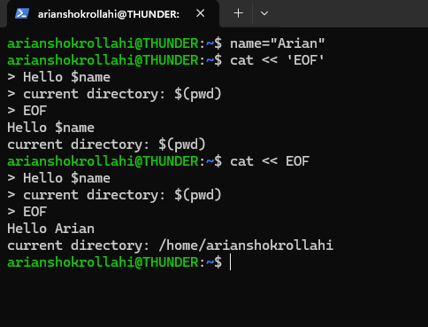
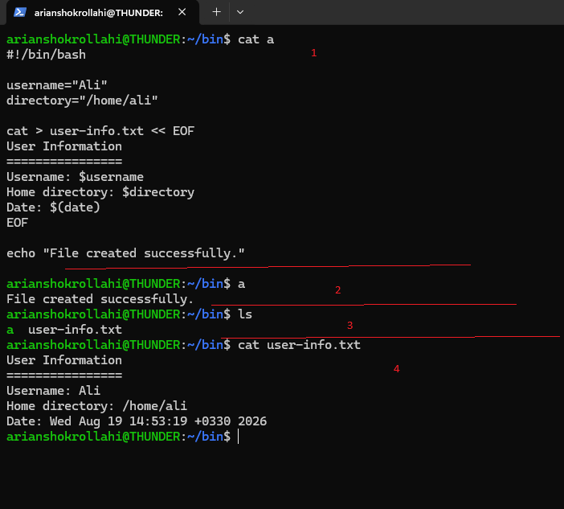

# EOF(end of file)
# این قسمت درمورد <mark>EOF</mark>
---
## اEOF چیست؟

ا`EOF` مخفف **End Of File** یعنی «پایان فایل» است.
اما در Bash، وقتی آن را در ساختار **Here Document** می‌بینیم، معمولاً نقش یک **علامت پایان متن** را دارد.

یعنی به Shell می‌گوییم:

> متن ورودی را از اینجا شروع کن و وقتی دوباره به خطی رسیدی که فقط `EOF` دارد، آن را تمام کن.

## ساختار دستور به چه صورته؟
```
command << EOF
text
EOF
```
---
## بریم چند مثال و کاربرید  EOF بزنیم؟
مثال اول: چاپ چند خط ساده
```
cat << EOF
Hello
This is a multi-line text.
EOF

output--->
Hello
This is a multi-line text.

```
مثال دوم: 
```
cat << EOF
first line
second line
third line
EOF

output--->
first line
second line
third line
```
مثال سوم: مدل دیگه استفادش ساختن فایل متنی است
```
cat > notes.txt << EOF
Linux is an operating system.
Bash is a shell.
EOF

محتوایه فایل notes.txt
Linux is an operating system.
Bash is a shell.

```
مثال چهارم: استفاده از متغیر ها داخل EOF
```
name="Ali"

cat << EOF
Hello $name
EOF

output--->
Hello Ali
```
مثال پنجم: commnd subtitution هم انجام میشود درونش.
```
cat << EOF
Current user: $(whoami)
Current directory: $(pwd)
EOF

output--->
Current user: arianshokrollahi
Current directory: /home/arianshokrollahi
```
مثال ششم : جلوگیری از اجرای متغیر ها.اگر `EOF` را داخل کوتیشن بگذاری دیگر متغیر ها و دستور ها اجرا نمیشه:
```
name="Ali"

cat << 'EOF'
Hello $name
Current directory: $(pwd)
EOF

output--->
Hello $name
Current directory: $(pwd)


```
---
## پس دو نکته مهم:
1- در حالت عادی EOF که بدون سینگل کوت است گسترش ها اتفاق میوفته
2- در حالت کی 'EOF'با سینگل کوت است گسترش اتفاق نمیوفته
<p align="center">
	
</p>
---
## و آخرین مثالی که از این قسمت بزنیم
مثال هفتم: کاربرد EOF درون shell script:
در این مثال:

- یک فایل به نام `user-info.txt` ساخته می‌شود.
- مقدار متغیرها داخل فایل قرار می‌گیرد.
- دستور `date` اجرا می‌شود.
- خروجی `date` نیز داخل فایل نوشته می‌شود.
```
#!/bin/bash

username="Ali"
directory="/home/ali"

cat > user-info.txt << EOF
User Information
================
Username: $username
Home directory: $directory
Date: $(date)
EOF

echo "File created successfully."

```
<p align="center">
	
</p>
