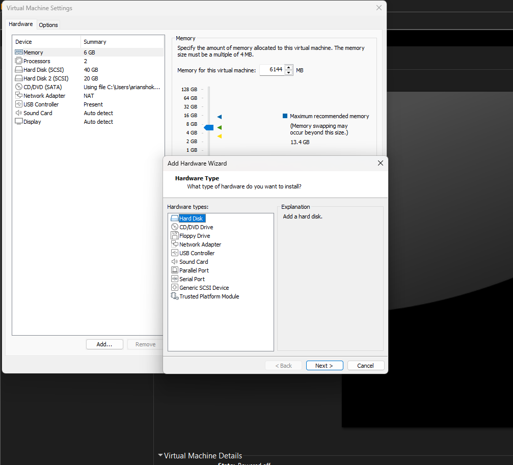
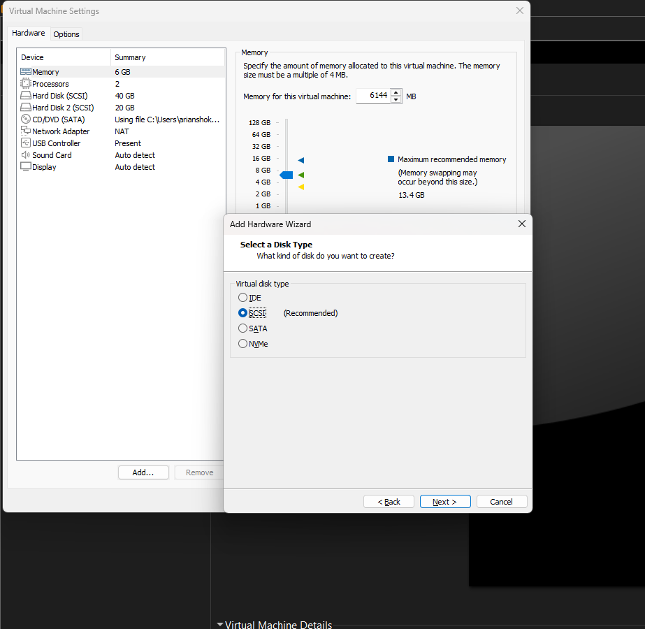

## در این قسمت بهتون درمورد اضافه کردن هارد دیسک میگویم
---
1. ماشین مجازی که توش هستید رو اگر در حال اجرا اون لینوکس هستید sudo poweroff
2. و اگر نیستید برید در منو چپ ماشین مجازی و گزینه edit virtual machine settingsرو بزنید
3. حالا صحفه ای به اسم virtual machine settings باز میشه 
4. رویه hardware بزنید چون همونطور که میدونید دو پوشه درست کردم یکی برایه سخت افزار(hardware) و یکی هم برایه تنظیمات یا (option)الان ما تویه سخت افزاریم
5. گزینه ادد پایین صحفه رو بزنید
6. صحفه ای باز میشه و همانطور که میخوایم هارد دیسک رو انتخاب و گزینه ی next رو میزنیم
<p align="center">
	
</p>
---
7. میبیند مدل هایه مختلف دیسک رو نشون داده و براساس دیسکتون انتخاب کنید من SCSIرو انتخاب کردم و انتخاب کنید و next رو بزنید

<p align="center">
	
</p>
---
8. این توضیحات رو مد نظر داشته باشید ولی معمولا اولی رو انتخاب میکنیم

### 1) **Create a new virtual disk** ✅ (معمولاً همین را انتخاب می‌کنیم)

- یک هارد مجازی جدید برای VM می‌سازد.
- در سیستم عامل مهمان (Linux) مثل یک دیسک واقعی جدید دیده می‌شود:

```
/dev/sdb
```

مثلاً:

```
/dev/sda  → دیسک اصلی سیستم
/dev/sdb  → دیسک جدیدی که اضافه کردی
```

- برای تمرین‌های **partition, filesystem, mount, LVM** بهترین گزینه است.

مثال:

```
Create new virtual disk
        ↓
20GB disk
        ↓
Linux sees /dev/sdb
        ↓
fdisk /dev/sdb
        ↓
mkfs.ext4
        ↓
mount
```

---

### 2) **Use an existing virtual disk**

- یعنی قبلاً یک فایل هارد مجازی داری (`.vmdk`) و می‌خواهی همان را دوباره وصل کنی.
- اطلاعات داخل آن هارد حفظ می‌شود.

مثال:

```
old-disk.vmdk
        ↓
Attach to VM
        ↓
same data appears
```

کاربرد:

- انتقال VM
- استفاده از یک دیسک آماده
- backup restore

---

### 3) **Use a physical disk (for advanced users)**

- مستقیم یک هارد واقعی سیستم Host را به VM می‌دهد.
- VM به دیسک فیزیکی واقعی دسترسی پیدا می‌کند.

مثال:

```
Physical SSD/HDD
        ↓
VMware
        ↓
Linux VM
```

کاربرد:

- تست‌های خاص storage
- سرورها
- کارهای پیشرفته

خطر:

- اگر اشتباه انتخاب شود ممکن است اطلاعات هارد واقعی پاک شود.
<p align="center">
	
</p>
---
9. اینم از توضیح گزینه ها
### **Maximum disk size**

حجم هارد مجازی است.

مثلاً:

```
20 GB
```

یعنی لینوکس یک دیسک ۲۰ گیگابایتی می‌بیند.

---

### **Allocate all disk space now**

یعنی آیا همین الان کل حجم را روی هارد اصلی کامپیوترت رزرو کند یا نه.

✅ **تیک نزنی (پیشنهاد برای تمرین):**

- اول فقط مقدار کمی فضا می‌گیرد.
- هرچقدر دیتا اضافه کنی، بزرگ‌تر می‌شود.

مثال:

```
Virtual disk: 20GB
اول: 500MB روی Host
بعد از پر شدن: 5GB
```

✅ **تیک بزنی:**

- همان لحظه کل ۲۰GB از هارد کامپیوترت گرفته می‌شود.

---

### **Store virtual disk as a single file**

یک فایل بزرگ می‌سازد:

```
disk.vmdk
```

- کمی سریع‌تر
- انتقال سخت‌تر

---

### **Split virtual disk into multiple files**

چند فایل کوچک می‌سازد:

```
disk-s001.vmdk
disk-s002.vmdk
disk-s003.vmdk
```

- انتقال راحت‌تر
- برای VMware معمولی مناسب‌تر

---

### تنظیم پیشنهادی برای تو (تمرین Linux Storage):

```
Maximum disk size: 20GB

☐ Allocate all disk space now

● Split virtual disk into multiple files
```
<p align="center">
	
</p>
---
### **Where would you like to store the disk file?**

یعنی مسیر ذخیره شدن دیسک جدید.

مثلاً:

```
C:\Users\arian\Documents\Virtual Machines\Ubuntu\
```

اینجا فایل‌هایی مثل این ساخته می‌شوند:

```
Ubuntu-s001.vmdk
Ubuntu-s002.vmdk
...
```

پیشنهاد من:

✅ همان مسیر پیش‌فرض VMware را بگذار.

یا اگر می‌خواهی مرتب باشد:

مثلاً:

```
D:\VMs\Ubuntu\disks\
```

(اگر درایو D فضای بیشتری دارد بهتر است.)

نکته:

- این **مسیر داخل لینوکس نیست**.
- این فقط محل نگهداری فایل دیسک روی ویندوز تو است.
- بعداً داخل Ubuntu فقط آن را به شکل `/dev/sdb` می‌بینی.

پس:

1. مسیر را انتخاب کن.
2. اسم پیش‌فرض را تغییر نده.
3. Finish بزن.

<p align="center">
	
</p>
--- 
10. حالا اگر در ماشین مجازی پایین edit virtual machine settings رو نگاه کنی نشون میده هارد دیسکی اضافه شده اولی که عدد نداره همونیه که در هنگام add virtual machine بهش سایز میدی و میگی چقد باشه و 2 میشه یکی بعد اون 3 یکی بعد دو که ساختی ....

بعد از اینکه هارد جدید را در VMware اضافه کردی، لینوکس خودش اسمش را می‌سازد. برای دیدنش این کارها را انجام بده:

### 1) وارد Linux شو و بزن:

```
lsblk
```

مثلاً خروجی:

```
NAME   SIZE
sda    40G
├─sda1  1G
└─sda2 39G
sdb    20G
```

اینجا:

- `sda` → هارد اصلی سیستم
- `sdb` → هارد جدیدی که اضافه کردی

---

### 2) اگر چند هارد اضافه کنی:

اولی:

```
/dev/sda
```

دومی:

```
/dev/sdb
```

سومی:

```
/dev/sdc
```

چهارمی:

```
/dev/sdd
```

یعنی لینوکس به ترتیب حروف می‌دهد.
